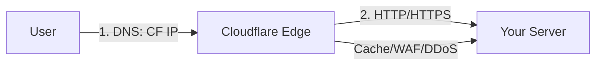
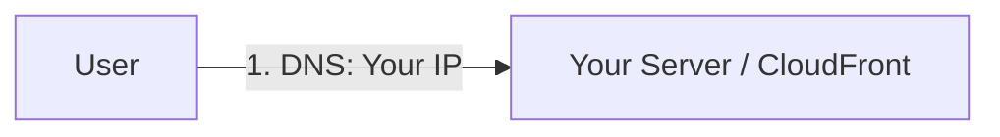

# DNS, Certificates, Proxies & DDoS: A Production Guide

## Table of Contents
1. [How DNS Works](#how-dns-works)
2. [SSL/TLS Certificates](#ssltls-certificates)
3. [Proxy Mechanisms](#proxy-mechanisms)
4. [DDoS Attacks & Mitigation](#ddos-attacks--mitigation)
5. [Real-World Outages Analysis](#real-world-outages-analysis)
6. [Production Best Practices](#production-best-practices)

---

## How DNS Works

### The DNS Resolution Chain

```
User types "example.com" in browser
         ↓
1. Browser cache (milliseconds)
         ↓ (if miss)
2. OS cache (milliseconds)
         ↓ (if miss)
3. Router cache (milliseconds)
         ↓ (if miss)
4. ISP DNS resolver (10-50ms)
         ↓ (if miss)
5. Root DNS servers (.) → "Ask .com servers"
         ↓
6. TLD servers (.com) → "Ask example.com's nameservers"
         ↓
7. Authoritative nameservers → "Here's the IP: 93.184.216.34"
         ↓ (return chain)
8. ISP caches → Router caches → OS caches → Browser caches
         ↓
9. Browser connects to 93.184.216.34
```

### DNS Record Types

| Type | Purpose | Example | TTL Recommendation |
|------|---------|---------|-------------------|
| **A** | IPv4 address | `@ → 93.184.216.34` | 300s (5min) for prod |
| **AAAA** | IPv6 address | `@ → 2606:2800:220:1:...` | 300s (5min) |
| **CNAME** | Alias to another domain | `www → example.com` | 3600s (1hr) |
| **MX** | Mail server | `@ → mail.example.com` | 3600s (1hr) |
| **TXT** | Text records (SPF, DKIM) | Domain verification | 3600s (1hr) |
| **NS** | Nameserver delegation | `@ → ns1.cloudflare.com` | 86400s (24hr) |
| **CAA** | Certificate authority auth | Restrict SSL issuance | 86400s (24hr) |

### DNS Propagation & Caching

**Why DNS changes take time:**

```
Your Domain Registrar (GoDaddy)
    ↓ [Nameserver update: 24-48 hours]
Root DNS Servers (13 worldwide)
    ↓ [Referral cache: varies]
TLD Servers (.com, .net, etc.)
    ↓ [Zone cache: TTL-based]
Authoritative Nameservers (Cloudflare, Route53)
    ↓ [Record TTL: you control]
ISP DNS Resolvers (Millions worldwide)
    ↓ [Respect TTL but may cache longer]
End User Devices
```

**Best Practice:**
```bash
# Lower TTL 24h before making changes
# Old TTL: 3600s (1 hour)
# New TTL: 60s (1 minute)

# Make the change
# Wait: 60s × 2 = 2 minutes

# Restore TTL after verification
# New TTL: 3600s (1 hour)
```

---

## SSL/TLS Certificates

### Certificate Chain of Trust

```
Root Certificate Authority (CA)
    ↓ [Trusted by OS/Browser]
Intermediate Certificate Authority
    ↓ [Signed by Root CA]
Your Domain Certificate
    ↓ [Signed by Intermediate CA]
User's Browser
    ✓ Validates entire chain
    ✓ Checks domain name matches
    ✓ Checks expiration date
    ✓ Checks revocation status (OCSP/CRL)
```

### Certificate Validation Methods

#### 1. Domain Validation (DV) - Used by ACM, Let's Encrypt

**HTTP Challenge:**
```
CA: "Prove you control example.com"
You: "I'll put a file at http://example.com/.well-known/acme-challenge/token123"
CA: "Verified! Here's your certificate"

Time: ~5 minutes
```

**DNS Challenge (ACM uses this):**
```
CA: "Prove you control example.com"
You: "I'll add DNS record: _acme-challenge.example.com CNAME _xyz.acm-validations.aws"
CA: "Verified! Here's your certificate"

Time: 5-30 minutes (DNS propagation dependent)
```

#### 2. Organization Validation (OV)
- Requires company verification
- Shows organization name
- Time: 1-3 days
- Cost: $50-200/year

#### 3. Extended Validation (EV)
- Rigorous company verification
- Green address bar (legacy browsers)
- Time: 3-7 days
- Cost: $200-1000/year

### Certificate Pinning (Advanced)

```http
# HPKP Header (deprecated due to risks)
Public-Key-Pins: pin-sha256="base64=="; pin-sha256="backup-base64=="; max-age=5184000

# Modern approach: Certificate Transparency
Expect-CT: max-age=86400, enforce
```

**Why OpenAI/AWS avoid pinning:**
- Certificate rotation complexity
- Risk of self-DoS if backup pins lost
- Better: Use CAA records + monitoring

---

## Proxy Mechanisms

### Types of Proxies

#### 1. Forward Proxy (Traditional)
```
User → Corporate Proxy → Internet

Use cases:
- Content filtering
- Bandwidth control
- Anonymity (VPN, Tor)
```

#### 2. Reverse Proxy (CDN, Load Balancer)
```
User → Reverse Proxy → Origin Server(s)

Use cases:
- Load balancing
- SSL termination
- Caching
- DDoS protection
```

### Cloudflare Proxy vs DNS-Only

#### Cloudflare Proxy ON (Orange Cloud) ☁️



**Flow:**
1. DNS resolves to Cloudflare's IP (104.16.x.x)
2. User connects to Cloudflare
3. Cloudflare proxies to your origin
4. Cloudflare caches responses
5. Cloudflare blocks DDoS attacks

**Pros:**
- ✅ Unlimited DDoS protection (FREE)
- ✅ Web Application Firewall (WAF)
- ✅ Page caching at edge
- ✅ Hide origin IP address
- ✅ SSL between user ↔ CF automatic

**Cons:**
- ❌ Cloudflare sees all traffic (privacy concern)
- ❌ Additional latency hop
- ❌ Breaks some protocols (FTP, SSH, custom ports)
- ❌ Incompatible with CloudFront (double proxy)

#### Cloudflare Proxy OFF (Gray Cloud) ☁️



**Flow:**
1. DNS resolves to YOUR IP (or CloudFront)
2. User connects directly
3. No Cloudflare in data path

**Pros:**
- ✅ Lower latency (no extra hop)
- ✅ Compatible with CloudFront
- ✅ All protocols work
- ✅ End-to-end encryption visible

**Cons:**
- ❌ Origin IP exposed
- ❌ Limited DDoS protection (CloudFront's tier)
- ❌ No edge caching from Cloudflare
- ❌ No WAF protection from Cloudflare

### Why CloudFront + Cloudflare Proxy = ❌

```
User → Cloudflare Proxy → CloudFront → S3
        (104.16.x.x)      (d1234.cfd.net)

Problems:
1. Double caching (inconsistent)
2. Double SSL termination
3. CloudFront can't validate Cloudflare's cert
4. Extra latency
5. Confusing logs/analytics
```

**Best Practice:**
- **Cloudflare DNS only** (gray cloud) → CloudFront → S3
- Use CloudFront for caching/DDoS
- Use Cloudflare for FREE DNS + analytics

---

## DDoS Attacks & Mitigation

### Types of DDoS Attacks

#### 1. Volumetric Attacks (Layer 3/4)
**Flood the network pipes**

```
Normal traffic:  1 Gbps
DDoS traffic:   100-1000 Gbps

Attack types:
- UDP flood: 50% of attacks
- ICMP flood
- DNS amplification (1 byte request → 100KB response)
- NTP amplification (1:556 amplification factor!)
```

**Example DNS Amplification:**
```bash
# Attacker sends small request with spoofed source IP
dig @open-resolver.com example.com ANY +edns=0

# Response is 100x larger, sent to victim
# 1 Gbps attacker → 100 Gbps at victim
```


#### 2. Protocol Attacks (Layer 4)
**Exhaust connection tables**

```
SYN Flood:
Attacker → SYN → Server
Server → SYN-ACK → (spoofed IP, never responds)
Server waits... connection table fills... crash

Normal: 10,000 connections
Attack: 1,000,000+ connections
```

#### 3. Application Attacks (Layer 7)
**Exhaust server resources**

```
HTTP flood:
10,000 bots × 100 req/sec each = 1,000,000 req/sec
Normal capacity: 10,000 req/sec
Server CPU: 100% → crash

Slowloris:
Open 1000s of connections
Send HTTP headers very slowly
Keep connections alive indefinitely
Server: out of connection slots
```

### DDoS Mitigation Strategies

#### Layer 1-3: Network Level

```
BGP Anycast (How Cloudflare/Cloudfront work)
    ↓
User connects to nearest edge location (300+ worldwide)
    ↓
Attack distributed across all edge servers
    ↓
Each server handles: 1 Tbps ÷ 300 locations = 3.3 Gbps
    ↓
Easily mitigated at edge, never reaches origin
```

**Example: Cloudflare's Network**
- 310+ cities worldwide
- 100+ Tbps total capacity
- Largest attack mitigated: 3.8 Tbps (2024)
- Attack absorbed at edge, origin unaffected

#### Layer 4: Connection Level

```
SYN Cookies (Linux kernel feature)
    ↓
Don't allocate connection until ACK received
    ↓
Attackers can't exhaust connection table
    ↓
Legitimate users unaffected
```

**AWS Shield Standard** (FREE with CloudFront):
- SYN/UDP flood protection
- Reflection attack protection
- Layer 3/4 DDoS detection
- Automatic mitigation

#### Layer 7: Application Level

```
Rate Limiting
    ↓
100 req/sec per IP → Normal
1000 req/sec per IP → Suspicious
10000 req/sec per IP → Block
    ↓
Challenge suspicious with CAPTCHA
    ↓
Block confirmed bots
```

**Cloudflare WAF Rules** (FREE tier):
```javascript
// Rate limit example
(http.request.uri.path eq "/api/login" and rate(ip.src) > 10)

// Block known bad user agents
(http.user_agent contains "bot" and not http.user_agent contains "googlebot")

// Geographic blocking
(ip.geoip.country in {"CN" "RU"} and http.request.uri.path contains "/admin")
```

---

## Real-World Outages Analysis

### Case Study 1: Route53 Outage (2021)

**What Happened:**
```
Date: December 2021
Duration: ~2 hours
Affected: ~50% of Route53 queries in us-east-1

Root Cause:
1. Automated certificate renewal triggered
2. Certificate validation used Route53 API
3. Route53 API overloaded by validation requests
4. Circular dependency: DNS needed to validate cert, cert validation overwhelmed DNS
5. Cascading failure across Route53 control plane
```

**Impact:**
- Netflix: Service degraded
- PlayStation Network: Authentication issues
- Robinhood: Trading platform down
- Hundreds of SaaS companies affected

**Lesson:**
```
❌ Single DNS provider = Single Point of Failure
✅ Multi-DNS provider strategy (Route53 + Cloudflare)
✅ Separate control plane from data plane
✅ DNS should be simplest, most resilient service
```

### Case Study 2: Rogers Outage (Canada, 2022)

**What Happened:**
```
Date: July 2022
Duration: 19 hours
Affected: 12 million customers (30% of Canada)

Root Cause:
1. BGP routing configuration error during maintenance
2. BGP routes withdrawn globally
3. DNS couldn't resolve roggers.com domains
4. Emergency services (911) down
5. Payment systems nationwide failed
```

**Timeline:**
```
00:00 - Maintenance begins
01:30 - BGP routes withdrawn accidentally
01:35 - Complete network collapse
01:40 - Emergency services alerts
02:00 - Management realizes scope
12:00 - Partial restoration begins
19:00 - Full restoration

Economic impact: $150 million CAD lost
```

**Lesson:**
```
❌ Single national ISP with monolithic infrastructure
❌ BGP automation without sufficient safeguards
❌ No redundant emergency services path
✅ Staged rollouts for BGP changes
✅ Automated rollback on health check failures
✅ Separate critical infrastructure (911) from consumer network
```

### Case Study 3: OpenAI Outages (2023-2024)

**Multiple Incidents:**

#### Incident 1: DDoS Attack (November 2023)
```
Attack type: Layer 7 HTTP flood
Scale: Unknown (OpenAI doesn't publish)
Duration: Several hours, intermittent

Root cause:
- API endpoints targeted
- Rate limiting insufficient
- Cloudflare WAF rules not tuned
- Anonymous actors claimed responsibility
```

#### Incident 2: DNS Issues (March 2024)
```
Symptom: "DNS resolution failed"
Duration: ~1 hour
Affected: openai.com, api.openai.com, chat.openai.com

Suspected root cause:
- Split-horizon DNS misconfiguration OR
- TTL too low causing resolver cache misses OR
- DNSSEC validation failures

OpenAI response: Minimal transparency
```

**Why OpenAI is vulnerable:**
```
Factors:
1. Massive user base (100M+ users)
2. High-value target (GPT-4 API critical for businesses)
3. Real-time service (can't pre-cache responses)
4. Complex infrastructure (multiple regions, services)
5. Politically motivated attacks (AI controversy)
```

**Their Mitigation:**
```
✅ Multiple CDN providers (Cloudflare + others)
✅ Geo-distributed servers
✅ Rate limiting per API key
❌ Communication during outages (poor)
❌ Status page often delayed
```

### Case Study 4: Cloudflare Global Outage (June 2022)

**The Incident That Broke the Internet**

```
Date: June 21, 2022
Duration: ~27 minutes (main outage) + hours of intermittent issues
Affected: 19 million+ domains (12% of all Internet traffic)
Impact: Discord, Shopify, Coinbase, Cloudflare itself, and thousands more
```

#### How Cloudflare's Network Architecture Works

**Cloudflare's Global Anycast Network:**

```
310+ Data Centers Worldwide
    ↓ [All announce same IP ranges via BGP]
User in New York
    ↓ [BGP routes to closest location]
New York Data Center (EWR)
    ↓ [Cloudflare backbone network]
Origin Server (wherever it actually is)

Key concept: EVERY data center can serve ANY request
```

**Cloudflare's Backbone Network:**

```
Tier 1: Customer-facing edge (310+ locations)
    ↓ [Anycast, handles requests from users]
Tier 2: Core backbone (Major hubs: Ashburn, Amsterdam, Singapore, etc.)
    ↓ [Interconnects data centers, high-capacity links]
Tier 3: Origin cache layer
    ↓ [Caches origin content, reduces load on customer servers]

All tiers connected via:
- Private fiber
- Internet exchange points (IXPs)
- Transit providers
- Direct peering
```

**How Cloudflare's DNS Works:**

```
User queries: example.com
    ↓
Anycast DNS (1.1.1.1 or Cloudflare NS servers)
    ↓ [Query routed to nearest data center]
Local DNS resolver (cached)
    ↓ [If miss:]
Cloudflare's distributed database (Quicksilver)
    ↓ [Replicated across all data centers]
Returns: A record / CNAME / etc.

Speed: < 10ms globally (faster than most DNS providers)
Reliability: 100% uptime SLA (until June 2022...)
```

#### What Went Wrong: The Technical Details

**Timeline:**

```
06:27 UTC - Configuration change deployed to backbone network
06:34 UTC - Network collapse begins
06:35 UTC - Full outage across all 19 data center hubs
06:47 UTC - Engineering realizes scope
06:51 UTC - Emergency rollback begins
06:58 UTC - Partial restoration
07:42 UTC - Full service restored
```

**Root Cause Analysis:**

**1. The Configuration Change**

```
Goal: Re-architect network to improve resilience (ironic!)
Change: Modify BGP policies on core backbone routers

What should have happened:
- Gradual rollout to core routers
- Traffic engineering optimization
- Better redundancy

What actually happened:
- Pushed to all core routers simultaneously
- Policy conflict in BGP configuration
- Routers couldn't decide best path
- BGP sessions flapped (up/down repeatedly)
```

**2. The Chain Reaction**

```python
# Simplified representation of what happened

# Step 1: Configuration applied
for router in core_backbone_routers:
    router.apply_config(new_bgp_policy)

# Step 2: BGP adjacencies destabilized
bgp_sessions = check_bgp_sessions()
# Result: 50% of sessions flapping

# Step 3: Route withdrawal cascade
if bgp_flapping:
    withdraw_routes()  # Safety mechanism
    # But ALL routers did this simultaneously!

# Step 4: Network partition
# Core routers couldn't reach each other
# Edge data centers became isolated islands
# Each island had some routes, but not all

# Step 5: DNS resolution fails
# Cloudflare DNS couldn't query its own database
# Database shards were unreachable
# Result: SERVFAIL for millions of domains
```

**3. Why It Cascaded So Badly**

```
Problem 1: Single failure domain
- All core routers affected simultaneously
- No gradual rollout, no canary deployment
- All-or-nothing change

Problem 2: Circular dependency
- Cloudflare's control plane uses Cloudflare's network
- Can't fix Cloudflare without Cloudflare working
- Engineers had to use out-of-band emergency access

Problem 3: Automated safety mechanisms backfired
- Routers detected instability
- Automatically withdrew routes to "protect" the network
- This made the problem worse, not better

Problem 4: Global scope
- Anycast means ONE problem = EVERYWHERE
- Can't route around the problem
- No geographic isolation
```

**The Smoking Gun:**

```
# Actual configuration error (simplified)

# OLD CONFIG (worked fine):
route-map CORE-BACKBONE permit 10
  match community TIER1
  set local-preference 200

# NEW CONFIG (broke everything):
route-map CORE-BACKBONE permit 10
  match community TIER1
  match community TIER2  # Added this
  set local-preference 200

# Problem: TIER1 and TIER2 overlap
# BGP couldn't determine best path
# Result: Route instability and flapping
```

#### Impact Analysis

**Affected Services:**

```
Direct impact:
- All sites using Cloudflare DNS (orange cloud)
- All sites using Cloudflare proxy
- Cloudflare's own services (dashboard, API)

Estimated losses:
- E-commerce: ~$100 million in sales (27 minutes)
- SaaS companies: Customer churn, support costs
- Cryptocurrency exchanges: Trading halted

Cloudflare's reputation:
- "100% uptime" claim broken
- Enterprise customers questioned reliability
- Triggered multi-CDN migration discussions
```

**Why Some Sites Stayed Up:**

```
✅ Sites with multi-DNS strategy
   - Primary: Cloudflare
   - Secondary: Route53
   → DNS resolved via Route53 during outage

✅ Sites with Cloudflare proxy OFF (gray cloud)
   - DNS resolved directly
   - CloudFront/other CDNs unaffected

❌ Sites with ONLY Cloudflare
   - Complete outage
   - No fallback
```

#### Cloudflare's Response

**Post-Mortem (Published June 24, 2022):**

```markdown
Excerpt from their post-mortem:

"The outage was caused by a change intended to increase network 
resilience in our busiest locations. A configuration error caused 
BGP announcements to be withdrawn, severely disrupting traffic 
at 19 of our core data centers."

Timeline:
- Incident detected: 06:34 UTC
- Incident acknowledged: 06:47 UTC (13 minute delay!)
- Root cause identified: 06:51 UTC
- Rollback initiated: 06:51 UTC
- Service restored: 06:58 UTC (main), 07:42 UTC (full)

Contributing factors:
1. Insufficient testing of backbone change
2. Lack of gradual rollout
3. Inadequate rollback procedures
4. No "break glass" emergency routing

Lessons learned:
1. Never push network changes to all core routers simultaneously
2. Always maintain out-of-band access
3. Test configuration changes in staging (they did, but incompletely)
4. Implement automated rollback on health check failures
```

**What Changed After:**

```
Immediate actions (announced):
1. Mandatory staged rollouts for infrastructure changes
2. Enhanced pre-deployment testing
3. Improved monitoring and alerting
4. "Panic button" for instant global rollback

Long-term improvements:
1. Network segmentation (isolated failure domains)
2. Better "split-brain" handling
3. Control plane redundancy
4. Enhanced chaos engineering

Reality check:
- Similar incident in July 2024 (smaller scale)
- Shows systemic issues remain
- Perfect resilience is impossible at this scale
```

#### Technical Deep-Dive: BGP and Route Flapping

**What is BGP Route Flapping?**

```
Normal BGP:
Router A ←[stable connection]→ Router B
Route announced: "I can reach 104.16.0.0/12"
Route stays stable for days/weeks/months

BGP Flapping:
Router A ←[unstable]→ Router B
06:34:00 - "I can reach 104.16.0.0/12" ✓
06:34:01 - "Wait, nevermind, I can't" ✗
06:34:02 - "Actually yes I can" ✓
06:34:03 - "No wait..." ✗
(repeats hundreds of times per minute)

Impact:
- Upstream routers confused
- Routes withdrawn globally
- Internet can't reach Cloudflare IPs
- All Cloudflare services unreachable
```

**Why Cloudflare's Anycast Made It Worse:**

```
Traditional hosting:
example.com → 93.184.216.34 (one IP)
If that server dies, only example.com affected

Cloudflare Anycast:
example.com → 104.16.x.x (Cloudflare's IP range)
ALL data centers announce same IP range
If BGP breaks for that range → ALL sites affected

Scale:
- 1 misconfiguration
- 19 affected routers
- 310 data centers impacted  
- 19 million domains down

Blast radius: Global
```

#### Comparison: Cloudflare vs Other CDN Outages

| Incident | Provider | Date | Duration | Root Cause |
|----------|----------|------|----------|------------|
| **Cloudflare** | Cloudflare | June 2022 | 27 min | BGP configuration error |
| Fastly | Fastly | June 2021 | 49 min | Software bug in edge servers |
| Akamai | Akamai | July 2021 | 90 min | DNS software bug |
| AWS CloudFront | AWS | Dec 2021 | 120+ min | Network device overload |

**Common themes:**
1. Configuration/software changes during business hours
2. Insufficient testing
3. Cascading failures
4. Global impact due to distributed architecture

### Case Study 5: AWS us-east-1 Outages (Multiple)

**Why us-east-1 fails more often:**

```
us-east-1 characteristics:
- First AWS region (2006)
- Largest region (most services, most customers)
- Tightly coupled services (circular dependencies)
- Legacy infrastructure mixed with modern
```

**Notable Incidents:**

#### December 2021: Network device overload
```
Affected services:
- Amazon.com (own retail site!)
- Ring doorbells
- Alexa
- Disney+
- Netflix (partially)

Root cause:
Network device issue → Route53 unhealthy
Route53 down → Can't route to services
Services down → More requests → Even more load
Positive feedback loop of doom
```

#### November 2020: Kinesis API throttling
```
Cascade:
Kinesis → CloudWatch → Lambda → Many dependent services

Lesson: Dependency mapping critical
```

**Why it matters:**
```
~33% of all websites use AWS
us-east-1 hosts ~40% of AWS workloads
Single region failure = Internet disruption
```

---

## Production Best Practices

### 1. Multi-DNS Provider Strategy

**Architecture:**
```
Primary DNS: Cloudflare
Secondary DNS: Route53
Tertiary DNS: DNS Made Easy

NS records at registrar:
  ns1.cloudflare.com
  ns2.cloudflare.com
  ns1.awsdns.com
  ns2.awsdns.com
  ns1.dnsmadeeasy.com
```

**How it works:**
- If Cloudflare down, resolvers try Route53
- If both down, try DNS Made Easy
- Probability all 3 down simultaneously: ~0.00001%

**Cost:**
- Cloudflare: FREE
- Route53: $0.50/month
- DNS Made Easy: $30/month

**ROI:** Worth it for critical services

### 2. Multi-CDN Strategy

**Primary:** CloudFront (AWS)
**Secondary:** Cloudflare (can enable proxy in emergency)
**Failover:** Direct to origin (S3)

**Implementation:**
```javascript
// In application code
const cdnEndpoints = [
  'https://d1234.cloudfront.net',  // Primary
  'https://cdn.example.com',        // Cloudflare (Proxy ON in emergency)
  'https://s3-bucket.s3.amazonaws.com' // Origin fallback
];

async function fetchWithFailover(path) {
  for (const endpoint of cdnEndpoints) {
    try {
      const response = await fetch(`${endpoint}${path}`, { timeout: 5000 });
      if (response.ok) return response;
    } catch (error) {
      console.warn(`${endpoint} failed, trying next...`);
      continue;
    }
  }
  throw new Error('All CDN endpoints failed');
}
```

### 3. Certificate Management

**Automation is critical:**

```bash
# Check certificate expiration
openssl s_client -servername example.com -connect example.com:443 </dev/null 2>/dev/null | \
  openssl x509 -noout -dates

# Alert if <30 days remaining
# Most outages are expired certificates!
```

**Best practices:**
```
✅ Automated renewal (Let's Encrypt, ACM)
✅ 60-day alert before expiration
✅ 30-day escalation
✅ 7-day emergency alert
✅ Multiple contact methods (email, Slack, PagerDuty)
❌ Never manual certificate renewal in production
```

**ACM Auto-Renewal:**
- ACM automatically renews 60 days before expiration
- Validates via same DNS method
- Zero-downtime replacement
- No action needed if DNS records remain

### 4. DDoS Protection Layers

```
Layer 1: Network (BGP, Anycast)
    └─ Provider: Cloudflare / AWS Shield / Akamai
    └─ Capacity: Multi-Tbps
    
Layer 2: Protocol (SYN cookies, rate limiting)
    └─ Provider: Cloudflare WAF / AWS WAF
    └─ Capacity: Millions req/sec
    
Layer 3: Application (CAPTCHA, device fingerprinting)
    └─ Provider: Your application + WAF rules
    └─ Capacity: Your origin capacity
    
Layer 4: Business logic (API keys, OAuth, rate limits)
    └─ Provider: Your application code
    └─ Capacity: Your database/service limits
```

**Defense in depth:**
```python
# Example: Multi-layer API protection
@app.route('/api/expensive-operation')
@rate_limit("100/hour")  # Layer 1: Global rate limit
@cloudflare_challenge()  # Layer 2: CAPTCHA if suspicious
@require_api_key()       # Layer 3: Authentication
@rate_limit_per_user("10/hour")  # Layer 4: Per-user limit
def expensive_operation():
    # Your code here
    pass
```

### 5. Monitoring & Alerting

**Metrics to monitor:**

```
DNS:
- Query response time (should be <50ms)
- Query success rate (should be >99.99%)
- NXDOMAIN rate (sudden spike = DNS attack)

SSL/TLS:
- Certificate expiration days remaining
- Handshake latency
- Cipher suite distribution

CDN/Proxy:
- Hit rate (should be >80% for static content)
- Origin fetch count (sudden spike = cache issue)
- 5xx error rate
- P50, P95, P99 latency

DDoS:
- Requests per second (establish baseline)
- Bandwidth utilization
- Unique IP count
- User-agent diversity
```

**Alert thresholds:**

```yaml
# Example: PagerDuty/Datadog config
alerts:
  - name: "DNS resolution failing"
    condition: "dns_success_rate < 99%"
    severity: critical
    notify: ["on-call-engineer", "slack-incidents"]
    
  - name: "Certificate expiring soon"
    condition: "ssl_days_remaining < 30"
    severity: warning
    notify: ["devops-team"]
    
  - name: "Possible DDoS attack"
    condition: "requests_per_second > (baseline * 5)"
    severity: critical
    notify: ["on-call-engineer", "security-team"]
```

### 6. Chaos Engineering

**Proactively break things:**

```bash
# Chaos Toolkit example
chaos run experiments/dns-failure.yaml

# Experiment: Simulate DNS provider outage
# 1. Temporarily remove Cloudflare NS records
# 2. Verify Route53 handles all traffic
# 3. Monitor application health
# 4. Restore Cloudflare
# 5. Document learnings
```

**Regular drills:**
- Monthly: Minor component failure (single DNS server)
- Quarterly: Major component failure (entire DNS provider)
- Annually: Multi-region disaster (entire cloud region down)

### 7. Incident Response Playbooks

```markdown
# DNS Outage Playbook

## Detection
- Alert: "DNS resolution failing"
- Verify: `dig @8.8.8.8 example.com` returns SERVFAIL

## Immediate Actions (< 5 min)
1. Check status pages:
   - Cloudflare: status.cloudflare.com
   - Route53: status.aws.amazon.com
2. If provider issue: Nothing to do, wait
3. If our issue: Check NS records at registrar

## Mitigation (< 15 min)
1. If Cloudflare down: Remove Cloudflare NS records
2. If Route53 down: Remove Route53 NS records  
3. If both down: Enable Cloudflare proxy (orange cloud)
   - Traffic flows through Cloudflare edge
   - Bypasses traditional DNS
   - Temporary until providers recover

## Communication
- Status page update: "Investigating DNS issues"
- Twitter: "We're aware of connection issues..."
- Post-incident: Full transparency within 72 hours
```

---

## Summary: The Perfect Production Setup

```
Domain Registrar: Namecheap/Google Domains
    ↓ [NS records point to multiple providers]
    
DNS Providers: Cloudflare (primary) + Route53 (secondary)
    ↓ [A/CNAME records]
    
CDN Layer: CloudFront (primary)
    ↓ [Cache + DDoS protection]
    
Origin: S3 (or your application servers)
    ↓ [Actual content]
    
Monitoring: Datadog/New Relic/Prometheus
    ↓ [Alerts on anomalies]
    
Incident Response: PagerDuty + Slack + Runbooks
```

**Costs for bulletproof setup:**
- Domain: $12/year
- Cloudflare DNS: FREE
- Route53 DNS: $6/year
- DNS Made Easy: $360/year (optional, for enterprise)
- CloudFront: ~$1-50/month depending on traffic
- Monitoring: $0-200/month
- **Total: ~$400-650/year for enterprise-grade reliability**

**Availability math:**
- Single DNS provider: 99.9% = ~8 hours downtime/year
- Dual DNS providers: 99.99% = ~52 minutes downtime/year
- Triple DNS + Multi-CDN: 99.999% = ~5 minutes downtime/year

**Worth it? Absolutely.** Downtime costs:
- E-commerce: $5000-10000/hour
- SaaS: $2000-50000/hour  
- Enterprise: $100000+/hour

Prevention is always cheaper than downtime.
