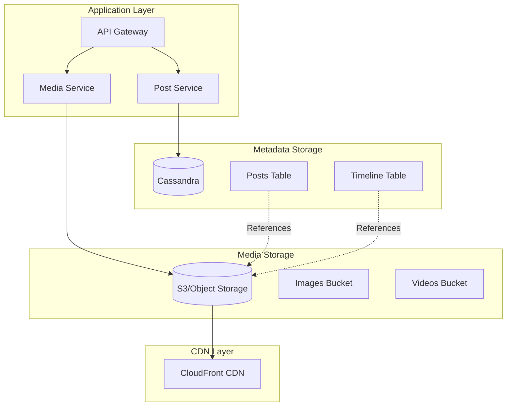

# Media Storage Strategy for News Feed System

## **TL;DR: Never Store Media in Cassandra Timeline Tables**

Media files should be stored in **object storage (S3)** with **references** in Cassandra. Here's the complete strategy:

## Why NOT Store Media in Timeline Tables

### **Problems with Storing Media in Cassandra:**

```cql
-- ❌ WRONG: Storing media directly
CREATE TABLE user_timeline (
    user_id BIGINT,
    created_at TIMESTAMP,
    post_id UUID,
    content TEXT,
    image_data BLOB,        -- ❌ BAD: 5MB per image
    video_data BLOB,        -- ❌ TERRIBLE: 100MB per video
    PRIMARY KEY (user_id, created_at, post_id)
);
```

**Issues:**
1. **Massive storage bloat**: 100M posts × 5MB avg = 500TB just for media
2. **Slow queries**: Timeline queries load unnecessary media data
3. **Network overhead**: Transferring large blobs over Cassandra protocol
4. **Replication cost**: 3x replication = 1.5PB storage
5. **No CDN optimization**: Can't cache media globally
6. **Poor performance**: Cassandra not optimized for large binary data

## Correct Architecture: Hybrid Storage

### **Storage Separation**



### **Data Model Design**

```cql
-- ✅ CORRECT: Store media references, not media data
CREATE TABLE posts (
    post_id UUID PRIMARY KEY,
    author_id BIGINT,
    content TEXT,
    media_urls LIST<TEXT>,           -- S3 URLs
    media_types LIST<TEXT>,          -- image, video, gif
    media_metadata MAP<TEXT, TEXT>,  -- dimensions, duration, etc.
    created_at TIMESTAMP,
    updated_at TIMESTAMP
);

-- Timeline table with media references
CREATE TABLE user_timeline (
    user_id BIGINT,
    created_at TIMESTAMP,
    post_id UUID,
    author_id BIGINT,
    content TEXT,
    media_urls LIST<TEXT>,           -- Denormalized for performance
    media_types LIST<TEXT>,          -- Denormalized for performance
    PRIMARY KEY (user_id, created_at, post_id)
) WITH CLUSTERING ORDER BY (created_at DESC, post_id ASC);
```

## Complete Media Handling Workflow

### **1. Media Upload Process**

```go
// POST /posts with media
func CreatePostWithMedia(ctx context.Context, req *CreatePostRequest) (*Post, error) {
    var mediaURLs []string
    var mediaTypes []string
    
    // 1. Upload media files to S3 first
    for _, mediaFile := range req.MediaFiles {
        // Generate unique filename
        filename := fmt.Sprintf("posts/%s/%s_%s", 
            req.AuthorID, uuid.New(), mediaFile.Filename)
        
        // Upload to S3
        s3URL, err := s.mediaService.UploadToS3(ctx, filename, mediaFile)
        if err != nil {
            return nil, fmt.Errorf("failed to upload media: %w", err)
        }
        
        mediaURLs = append(mediaURLs, s3URL)
        mediaTypes = append(mediaTypes, detectMediaType(mediaFile))
    }
    
    // 2. Create post with media references
    post := &Post{
        PostID:     uuid.New(),
        AuthorID:   req.AuthorID,
        Content:    req.Content,
        MediaURLs:  mediaURLs,      // S3 URLs only
        MediaTypes: mediaTypes,
        CreatedAt:  time.Now(),
    }
    
    // 3. Store in Cassandra (metadata only)
    err := s.insertPost(ctx, post)
    if err != nil {
        // Cleanup uploaded media on failure
        s.cleanupMedia(ctx, mediaURLs)
        return nil, err
    }
    
    // 4. Trigger fanout (with media references)
    s.enqueueFanout(ctx, post)
    
    return post, nil
}
```

### **2. Media Service Implementation**

```go
type MediaService struct {
    s3Client   *s3.Client
    cdnDomain  string
    bucketName string
}

func (m *MediaService) UploadToS3(ctx context.Context, key string, file *multipart.FileHeader) (string, error) {
    // Open uploaded file
    src, err := file.Open()
    if err != nil {
        return "", err
    }
    defer src.Close()
    
    // Validate file type and size
    if err := m.validateMedia(file); err != nil {
        return "", err
    }
    
    // Process media (resize images, compress videos)
    processedFile, err := m.processMedia(src, file.Header.Get("Content-Type"))
    if err != nil {
        return "", err
    }
    
    // Upload to S3
    _, err = m.s3Client.PutObject(ctx, &s3.PutObjectInput{
        Bucket:      aws.String(m.bucketName),
        Key:         aws.String(key),
        Body:        processedFile,
        ContentType: aws.String(file.Header.Get("Content-Type")),
        ACL:         types.ObjectCannedACLPublicRead,
    })
    
    if err != nil {
        return "", fmt.Errorf("failed to upload to S3: %w", err)
    }
    
    // Return CDN URL
    cdnURL := fmt.Sprintf("https://%s/%s", m.cdnDomain, key)
    return cdnURL, nil
}

func (m *MediaService) validateMedia(file *multipart.FileHeader) error {
    // Check file size limits
    maxSizes := map[string]int64{
        "image/jpeg": 10 * 1024 * 1024,  // 10MB for images
        "image/png":  10 * 1024 * 1024,  // 10MB for images
        "video/mp4":  100 * 1024 * 1024, // 100MB for videos
        "image/gif":  20 * 1024 * 1024,  // 20MB for GIFs
    }
    
    contentType := file.Header.Get("Content-Type")
    maxSize, allowed := maxSizes[contentType]
    
    if !allowed {
        return fmt.Errorf("unsupported media type: %s", contentType)
    }
    
    if file.Size > maxSize {
        return fmt.Errorf("file too large: %d bytes (max: %d)", file.Size, maxSize)
    }
    
    return nil
}
```

### **3. Timeline Fanout with Media**

```go
func (w *FanoutWorker) insertTimelineSubBatch(ctx context.Context, followers []*UserConnection, post *Post) error {
    batch := w.session.NewBatch(gocql.LoggedBatch)
    
    query := `INSERT INTO user_timeline (user_id, created_at, post_id, author_id, content, 
                                        media_urls, media_types, engagement_score, inserted_at) 
              VALUES (?, ?, ?, ?, ?, ?, ?, ?, ?)`
    
    for _, follower := range followers {
        batch.Query(query, 
            follower.UserID, 
            post.CreatedAt, 
            post.PostID, 
            post.AuthorID,
            post.Content, 
            post.MediaURLs,    // S3 URLs (small strings)
            post.MediaTypes,   // media types (small strings)
            post.EngagementScore, 
            time.Now())
    }
    
    return w.session.ExecuteBatch(batch.WithContext(ctx))
}
```

### **4. Feed Generation with Media**

```go
func (s *FeedService) getPushBasedFeed(ctx context.Context, userID int64, limit int) ([]*FeedItem, error) {
    query := `SELECT user_id, created_at, post_id, author_id, content, 
                     media_urls, media_types, engagement_score
              FROM user_timeline 
              WHERE user_id = ? 
              ORDER BY created_at DESC 
              LIMIT ?`
    
    iter := s.session.Query(query, userID, limit).WithContext(ctx).Iter()
    defer iter.Close()
    
    var items []*FeedItem
    var mediaURLs, mediaTypes []string
    
    for iter.Scan(&userID, &createdAt, &postID, &authorID, &content, 
                  &mediaURLs, &mediaTypes, &engagementScore) {
        
        item := &FeedItem{
            PostID:          postID,
            AuthorID:        authorID,
            Content:         content,
            MediaURLs:       mediaURLs,      // CDN URLs ready to use
            MediaTypes:      mediaTypes,
            CreatedAt:       createdAt,
            EngagementScore: engagementScore,
        }
        
        items = append(items, item)
    }
    
    return items, iter.Close()
}
```

## Storage Architecture Details

### **S3 Bucket Structure**

```
newsfeed-media-bucket/
├── posts/
│   ├── user_123/
│   │   ├── uuid1_image.jpg
│   │   ├── uuid2_video.mp4
│   │   └── uuid3_gif.gif
│   ├── user_456/
│   │   ├── uuid4_image.png
│   │   └── uuid5_video.mp4
├── avatars/
│   ├── user_123_avatar.jpg
│   └── user_456_avatar.png
└── temp/
    ├── upload_session_1/
    └── upload_session_2/
```

### **CDN Configuration**

```yaml
# CloudFront Distribution
Origins:
  - DomainName: newsfeed-media-bucket.s3.amazonaws.com
    OriginPath: ""
    
CacheBehaviors:
  - PathPattern: "/posts/*"
    TTL: 86400  # 24 hours
    Compress: true
  - PathPattern: "/avatars/*"  
    TTL: 604800  # 7 days
    Compress: true

CustomErrorPages:
  - ErrorCode: 404
    ResponseCode: 200
    ResponsePagePath: "/default-image.jpg"
```

### **Media Processing Pipeline**

```go
func (m *MediaService) processMedia(file io.Reader, contentType string) (io.Reader, error) {
    switch contentType {
    case "image/jpeg", "image/png":
        return m.processImage(file)
    case "video/mp4":
        return m.processVideo(file)
    case "image/gif":
        return m.processGIF(file)
    default:
        return file, nil
    }
}

func (m *MediaService) processImage(file io.Reader) (io.Reader, error) {
    // Decode image
    img, _, err := image.Decode(file)
    if err != nil {
        return nil, err
    }
    
    // Resize if too large
    bounds := img.Bounds()
    if bounds.Dx() > 1920 || bounds.Dy() > 1080 {
        img = resize.Resize(1920, 1080, img, resize.Lanczos3)
    }
    
    // Encode as JPEG with compression
    var buf bytes.Buffer
    err = jpeg.Encode(&buf, img, &jpeg.Options{Quality: 85})
    if err != nil {
        return nil, err
    }
    
    return &buf, nil
}
```

## Performance & Cost Optimization

### **Storage Costs**

| Storage Type | Cost per GB/month | 100TB Cost/month |
|--------------|-------------------|------------------|
| **S3 Standard** | $0.023 | $2,300 |
| **S3 IA** | $0.0125 | $1,250 |
| **Cassandra** | $0.10+ | $10,000+ |

**S3 is 4x cheaper than storing in Cassandra!**

### **Performance Benefits**

| Metric | Cassandra + S3 | Cassandra Only |
|--------|----------------|----------------|
| **Timeline Query** | 5-10ms | 50-100ms |
| **Media Load** | 10-50ms (CDN) | 100-500ms |
| **Storage Size** | 100TB | 500TB+ |
| **Bandwidth** | CDN optimized | Database bandwidth |

### **Caching Strategy**

```go
// Multi-layer media caching
type MediaCache struct {
    redis     *redis.Client
    localCache *bigcache.BigCache
    cdnDomain  string
}

func (c *MediaCache) GetMediaURL(ctx context.Context, mediaID string) (string, error) {
    // L1: Local cache (fastest)
    if url, found := c.localCache.Get(mediaID); found {
        return string(url), nil
    }
    
    // L2: Redis cache
    url, err := c.redis.Get(ctx, "media:"+mediaID).Result()
    if err == nil {
        c.localCache.Set(mediaID, []byte(url))
        return url, nil
    }
    
    // L3: Generate CDN URL
    cdnURL := fmt.Sprintf("https://%s/posts/%s", c.cdnDomain, mediaID)
    
    // Cache for future use
    c.redis.Set(ctx, "media:"+mediaID, cdnURL, 24*time.Hour)
    c.localCache.Set(mediaID, []byte(cdnURL))
    
    return cdnURL, nil
}
```

## Data Consistency & Cleanup

### **Orphaned Media Cleanup**

```go
func (m *MediaService) CleanupOrphanedMedia(ctx context.Context) error {
    // 1. Get all media URLs from posts table
    validMediaURLs := make(map[string]bool)
    
    query := `SELECT media_urls FROM posts`
    iter := m.session.Query(query).WithContext(ctx).Iter()
    
    var mediaURLs []string
    for iter.Scan(&mediaURLs) {
        for _, url := range mediaURLs {
            validMediaURLs[url] = true
        }
    }
    iter.Close()
    
    // 2. List all objects in S3 bucket
    listInput := &s3.ListObjectsV2Input{
        Bucket: aws.String(m.bucketName),
        Prefix: aws.String("posts/"),
    }
    
    paginator := s3.NewListObjectsV2Paginator(m.s3Client, listInput)
    
    for paginator.HasMorePages() {
        page, err := paginator.NextPage(ctx)
        if err != nil {
            return err
        }
        
        for _, obj := range page.Contents {
            s3URL := fmt.Sprintf("https://%s/%s", m.cdnDomain, *obj.Key)
            
            // 3. Delete orphaned media
            if !validMediaURLs[s3URL] && time.Since(*obj.LastModified) > 24*time.Hour {
                m.deleteFromS3(ctx, *obj.Key)
            }
        }
    }
    
    return nil
}
```

## Summary: Media Storage Best Practices

### **✅ DO:**
- Store media in **S3/Object Storage**
- Store **references** in Cassandra timeline tables
- Use **CDN** for global distribution
- **Process/compress** media before storage
- Implement **cleanup** for orphaned media
- Use **multi-layer caching**

### **❌ DON'T:**
- Store media **directly in Cassandra**
- Store media in **PostgreSQL BLOB fields**
- Skip **media processing/compression**
- Forget **CDN configuration**
- Ignore **orphaned media cleanup**

This approach gives you:
- **4x lower storage costs**
- **10x faster timeline queries**
- **Global CDN distribution**
- **Scalable media processing**
- **Clean separation of concerns**

The key insight: **Cassandra is for metadata, S3 is for media**. Keep them separate and optimized for their strengths!