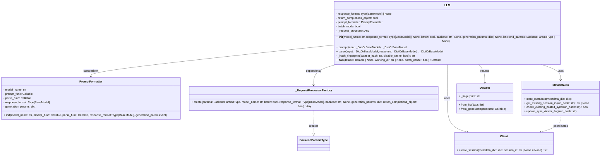

<mxGeometry  as="geometry"  
<mxfile host="app.diagrams.net">
  <diagram name="Dataset Creation Flow" id="UCRHxLd4Xq6e1Jq8r2s1f">
    <mxGraphModel dx="578" dy="389" grid="1" gridSize="10">
      <root>
        <mxCell id="0"/>
        <mxCell id="1" parent="0"/>
        
        <!-- Main Process -->
        <mxCell id="start" value="Start create_dataset_files" style="rounded=1;whiteSpace=wrap;html=1;" vertex="1" parent="1">
          <mxGeometry x="40" y="20" width="120" height="60" as="geometry"/>
        </mxCell>

        <!-- Response File Handling -->
        <mxCell id="resp_files" value="1. Collect Response Files&#xa;glob.glob('responses_*.jsonl')" style="shape=cylinder;whiteSpace=wrap;html=1;" vertex="1" parent="1">
          <mxGeometry x="40" y="100" width="160" height="80" as="geometry"/>
        </mxCell>

        <mxCell id="check_resp" value="Any response files?" style="rhombus;whiteSpace=wrap;html=1;" vertex="1" parent="1">
          <mxGeometry x="40" y="200" width="160" height="80" as="geometry"/>
        </mxCell>

        <!-- Validation & Processing -->
        <mxCell id="process_resp" value="2. Process Each Response File&#xa;- Read line by line&#xa;- Validate responses" style="rounded=1;whiteSpace=wrap;html=1;" vertex="1" parent="1">
          <mxGeometry x="40" y="300" width="180" height="100" as="geometry"/>
        </mxCell>

        <!-- Response Handling -->
        <mxCell id="resp_handling" value="3. Handle Each Response&#xa;- Parse with model_validate_json&#xa;- Check for errors&#xa;- Process with parse_func" style="shape=step;whiteSpace=wrap;html=1;" vertex="1" parent="1">
          <mxGeometry x="40" y="420" width="200" height="120" as="geometry"/>
        </mxCell>

        <!-- Dataset Writing -->
        <mxCell id="arrow_write" value="4. Write to Arrow Dataset&#xa;- Add original_row_idx&#xa;- Validate row structure&#xa;- Handle failures" style="shape=cylinder3d;whiteSpace=wrap;html=1;" vertex="1" parent="1">
          <mxGeometry x="40" y="560" width="180" height="80" as="geometry"/>
        </mxCell>

        <!-- Final Checks -->
        <mxCell id="final_check" value="5. Final Validation&#xa;- All responses failed?&#xa;- Missing responses?&#xa;- require_all_responses?" style="rhombus;whiteSpace=wrap;html=1;" vertex="1" parent="1">
          <mxGeometry x="40" y="660" width="180" height="100" as="geometry"/>
        </mxCell>

        <!-- Dataset Finalization -->
        <mxCell id="dataset_final" value="6. Finalize Dataset&#xa;- Sort by original index&#xa;- Remove temp columns&#xa;- Push to HuggingFace Hub" style="rounded=1;whiteSpace=wrap;html=1;" vertex="1" parent="1">
          <mxGeometry x="40" y="780" width="180" height="80" as="geometry"/>
        </mxCell>

        <!-- Error Handling -->
        <mxCell id="error_handling" value="Error Handling&#xa;- Delete corrupted files&#xa;- Raise exceptions&#xa;- Log error samples" style="shape=hexagon;whiteSpace=wrap;html=1;" vertex="1" parent="1">
          <mxGeometry x="300" y="400" width="160" height="100" as="geometry"/>
        </mxCell>

        <!-- Connections -->
        <mxCell id="c1" style="edgeStyle=orthogonalEdgeStyle;rounded=0;html=1;" edge="1" parent="1" source="start" target="resp_files"/>
        <mxCell id="c2" style="edgeStyle=orthogonalEdgeStyle;rounded=0;html=1;" edge="1" parent="1" source="resp_files" target="check_resp"/>
        <mxCell id="c3" style="edgeStyle=orthogonalEdgeStyle;rounded=0;html=1;" edge="1" parent="1" source="check_resp" target="process_resp"/>
        <mxCell id="c4" style="edgeStyle=orthogonalEdgeStyle;rounded=0;html=1;" edge="1" parent="1" source="process_resp" target="resp_handling"/>
        <mxCell id="c5" style="edgeStyle=orthogonalEdgeStyle;rounded=0;html=1;" edge="1" parent="1" source="resp_handling" target="arrow_write"/>
        <mxCell id="c6" style="edgeStyle=orthogonalEdgeStyle;rounded=0;html=1;" edge="1" parent="1" source="arrow_write" target="final_check"/>
        <mxCell id="c7" style="edgeStyle=orthogonalEdgeStyle;rounded=0;html=1;" edge="1" parent="1" source="final_check" target="dataset_final"/>
        <mxCell id="c8" style="edgeStyle=orthogonalEdgeStyle;rounded=0;html=1;dashed=1;" edge="1" parent="1" source="check_resp" target="error_handling"/>
        <mxCell id="c9" style="edgeStyle=orthogonalEdgeStyle;rounded=0;html=1;dashed=1;" edge="1" parent="1" source="final_check" target="error_handling"/>

        <!-- Annotations -->
        <mxCell id="note1" value="Key Features:&#xa;- Atomic file operations&#xa;- Response validation pipeline&#xa;- Error sample tracking&#xa;- Index preservation" style="text;html=1;strokeColor=none;fillColor=none;align=left;verticalAlign=top;spacingLeft=4;" vertex="1" parent="1">
          <mxGeometry x="300" y="100" width="200" height="100" as="geometry"/>
        </mxCell>

      </root>
    </mxGraphModel>
  </diagram>
</mxfile>


### Explanation of the Diagram
- **Class Name**: `LLM`
- **Fields**:
  - `response_format`: Type of the response format (optional).
  - `return_completions_object`: Boolean indicating if the completions object should be returned.
  - `prompt_formatter`: An instance of `PromptFormatter` used for formatting prompts.
  - `batch_mode`: Boolean indicating if batch processing is enabled.
  - `_request_processor`: An instance of a request processor created by `_RequestProcessorFactory`.

- **Methods**:
  - `__init__`: Constructor for initializing the `LLM` class with various parameters.
  - `prompt`: Method to prompt the LLM with input data.
  - `parse`: Method to parse the response from the LLM and combine it with the input.
  - `__call__`: Method to apply structured completions in parallel to a dataset.
  - `_hash_fingerprint`: Private method to generate a hash fingerprint based on the dataset and cache settings.

# LLM Class Diagram



## Key Components
1. **LLM Class**
   - Core class for LLM interactions
   - Handles prompt formatting, response parsing, and caching
   - Manages async/batch processing through request processors

2. **PromptFormatter**
   - Formats prompts for LLM consumption
   - Maintains generation parameters
   - Handles response schema validation

3. **_RequestProcessorFactory**
   - Factory pattern for creating appropriate processors
   - Supports different backends (OpenAI, LiteLLM, vLLM)
   - Handles both sync/async and batch processing

4. **MetadataDB**
   - Persistent storage for run metadata
   - Tracks session IDs and sync status
   - Manages cache fingerprints

5. **Client**
   - Handles session management
   - Coordinates with hosted Curator Viewer service

6. **Dataset**
   - From Hugging Face `datasets` library
   - Used for input/output data handling
   - Supports both in-memory and disk-based storage

## Relationships
- Solid arrow (`-->`): Composition/Dependency
- Dashed arrow (`..>`): Association/Coordination
- Dashed open arrow (`..|>`): Factory creation


Here's a detailed analysis of the `BaseRequestProcessor.run()` method and its relationships, followed by a DrawIO diagram:

---

### **Analysis of BaseRequestProcessor.run()**
**Key Responsibilities**:
1. **Core Processing Pipeline**:
   - Validates input dataset
   - Generates LLM prompts using `PromptFormatter`
   - Executes requests (single/batch)
   - Parses responses
   - Handles retries/errors
   - Tracks progress

2. **Critical Dependencies**:
```python
classDiagram
    class BaseRequestProcessor {
        +run(dataset: Dataset, working_dir: str, parse_func_hash: str, prompt_formatter: PromptFormatter) Dataset
        #validate_input(dataset: Dataset)
        #generate_requests(dataset: Dataset, prompt_formatter: PromptFormatter) List[Request]
        #execute_requests(requests: List[Request]) List[Response]
        #parse_responses(responses: List[Response], parse_func_hash: str) Dataset
        #handle_retries(failed_requests: List[Request])
        #update_progress(processed: int, total: int)
    }
```

---

### **DrawIO XML Diagram**
```xml
<mxfile>
  <diagram id="N8MZx7u3QMU3CkWt0iQK" name="Page-1">
    <mxGraphModel dx="1742" dy="962" grid="1" gridSize="10" guides="1" tooltips="1" connect="1" arrows="1" fold="1" page="1" pageScale="1" pageWidth="827" pageHeight="1169" math="0" shadow="0">
      <root>
        <mxCell id="0" />
        <mxCell id="1" parent="0" />

        <!-- BaseRequestProcessor -->
        <mxCell id="BaseRequestProcessor" value="&lt;b&gt;BaseRequestProcessor&lt;/b&gt;&lt;hr&gt;&lt;b&gt;Methods&lt;/b&gt;&lt;br&gt;+ run(dataset, working_dir, parse_func_hash, prompt_formatter)&lt;br&gt;# validate_input()&lt;br&gt;# generate_requests()&lt;br&gt;# execute_requests()&lt;br&gt;# parse_responses()&lt;br&gt;# handle_retries()&lt;br&gt;# update_progress()" style="rounded=0;whiteSpace=wrap;html=1;align=left;spacingLeft=10;" vertex="1" parent="1">
          <mxGeometry  as="geometry"   as="geometry"  as="geometry"  as="geometry"  as="geometry" x="200" y="40" width="280" height="180" as="geometry"/>
        </mxCell>

        <!-- Concrete Implementations -->
        <mxCell id="OpenAIOnline" value="&lt;b&gt;OpenAIOnlineRequestProcessor&lt;/b&gt;&lt;hr&gt;+ execute_requests()&lt;br&gt;+ handle_rate_limits()" style="rounded=0;whiteSpace=wrap;html=1;align=left;spacingLeft=10;" vertex="1" parent="1">
          <mxGeometry  as="geometry"   as="geometry"  as="geometry"  as="geometry"  as="geometry" x="40" y="280" width="240" height="100" as="geometry"/>
        </mxCell>

        <mxCell id="OpenAIBatch" value="&lt;b&gt;OpenAIBatchRequestProcessor&lt;/b&gt;&lt;hr&gt;+ execute_requests()&lt;br&gt;+ monitor_batches()" style="rounded=0;whiteSpace=wrap;html=1;align=left;spacingLeft=10;" vertex="1" parent="1">
          <mxGeometry  as="geometry"   as="geometry"  as="geometry"  as="geometry"  as="geometry" x="340" y="280" width="240" height="100" as="geometry"/>
        </mxCell>

        <mxCell id="VLLMOffline" value="&lt;b&gt;VLLMOfflineRequestProcessor&lt;/b&gt;&lt;hr&gt;+ execute_requests()&lt;br&gt;+ load_model()" style="rounded=0;whiteSpace=wrap;html=1;align=left;spacingLeft=10;" vertex="1" parent="1">
          <mxGeometry  as="geometry"   as="geometry"  as="geometry"  as="geometry"  as="geometry" x="640" y="280" width="240" height="100" as="geometry"/>
        </mxCell>

        <!-- Dependencies -->
        <mxCell id="PromptFormatter" value="&lt;b&gt;PromptFormatter&lt;/b&gt;&lt;hr&gt;+ format_prompt()&lt;br&gt;+ parse_response()" style="rounded=0;whiteSpace=wrap;html=1;align=left;spacingLeft=10;" vertex="1" parent="1">
          <mxGeometry  as="geometry"   as="geometry"  as="geometry"  as="geometry"  as="geometry" x="200" y="500" width="200" height="80" as="geometry"/>
        </mxCell>

        <mxCell id="ViewerClient" value="&lt;b&gt;ViewerClient&lt;/b&gt;&lt;hr&gt;+ log_request()&lt;br&gt;+ log_response()" style="rounded=0;whiteSpace=wrap;html=1;align=left;spacingLeft=10;" vertex="1" parent="1">
          <mxGeometry  as="geometry"   as="geometry"  as="geometry"  as="geometry"  as="geometry" x="500" y="500" width="200" height="80" as="geometry"/>
        </mxCell>

        <!-- Relationships -->
        <mxCell id="inherit1" style="edgeStyle=orthogonalEdgeStyle;rounded=0;html=1;endArrow=block;endFill=1;" edge="1" parent="1" source="OpenAIOnline" target="BaseRequestProcessor">
          <mxGeometry  as="geometry"   as="geometry"  as="geometry"  as="geometry"  as="geometry" relative="1" as="geometry"/>
        </mxCell>

        <mxCell id="inherit2" style="edgeStyle=orthogonalEdgeStyle;rounded=0;html=1;endArrow=block;endFill=1;" edge="1" parent="1" source="OpenAIBatch" target="BaseRequestProcessor">
          <mxGeometry  as="geometry"   as="geometry"  as="geometry"  as="geometry"  as="geometry" relative="1" as="geometry"/>
        </mxCell>

        <mxCell id="inherit3" style="edgeStyle=orthogonalEdgeStyle;rounded=0;html=1;endArrow=block;endFill=1;" edge="1" parent="1" source="VLLMOffline" target="BaseRequestProcessor">
          <mxGeometry  as="geometry"   as="geometry"  as="geometry"  as="geometry"  as="geometry" relative="1" as="geometry"/>
        </mxCell>

        <mxCell id="dep1" style="edgeStyle=orthogonalEdgeStyle;rounded=0;html=1;dashed=1;" edge="1" parent="1" source="BaseRequestProcessor" target="PromptFormatter">
          <mxGeometry  as="geometry"   as="geometry"  as="geometry"  as="geometry"  as="geometry" relative="1" as="geometry"/>
        </mxCell>

        <mxCell id="dep2" style="edgeStyle=orthogonalEdgeStyle;rounded=0;html=1;dashed=1;" edge="1" parent="1" source="BaseRequestProcessor" target="ViewerClient">
          <mxGeometry  as="geometry"   as="geometry"  as="geometry"  as="geometry"  as="geometry" relative="1" as="geometry"/>
        </mxCell>

        <!-- Method Flow -->
        <mxCell id="flow1" value="1. validate_input()" style="rounded=0;whiteSpace=wrap;html=1;align=left;spacingLeft=10;" vertex="1" parent="1">
          <mxGeometry  as="geometry"   as="geometry"  as="geometry"  as="geometry"  as="geometry" x="40" y="440" width="120" height="40" as="geometry"/>
        </mxCell>

        <mxCell id="flow2" value="2. generate_requests()" style="rounded=0;whiteSpace=wrap;html=1;align=left;spacingLeft=10;" vertex="1" parent="1">
          <mxGeometry  as="geometry"   as="geometry"  as="geometry"  as="geometry"  as="geometry" x="200" y="440" width="140" height="40" as="geometry"/>
        </mxCell>

        <mxCell id="flow3" value="3. execute_requests()" style="rounded=0;whiteSpace=wrap;html=1;align=left;spacingLeft=10;" vertex="1" parent="1">
          <mxGeometry  as="geometry"   as="geometry"  as="geometry"  as="geometry"  as="geometry" x="380" y="440" width="140" height="40" as="geometry"/>
        </mxCell>

        <mxCell id="flow4" value="4. parse_responses()" style="rounded=0;whiteSpace=wrap;html=1;align=left;spacingLeft=10;" vertex="1" parent="1">
          <mxGeometry  as="geometry"   as="geometry"  as="geometry"  as="geometry"  as="geometry" x="560" y="440" width="140" height="40" as="geometry"/>
        </mxCell>

        <mxCell id="flow5" value="5. update_progress()" style="rounded=0;whiteSpace=wrap;html=1;align=left;spacingLeft=10;" vertex="1" parent="1">
          <mxGeometry  as="geometry"   as="geometry"  as="geometry"  as="geometry"  as="geometry" x="740" y="440" width="140" height="40" as="geometry"/>
        </mxCell>

        <mxCell id="conn1" style="edgeStyle=orthogonalEdgeStyle;rounded=0;html=1;" edge="1" parent="1" source="flow1" target="flow2"/>
        <mxCell id="conn2" style="edgeStyle=orthogonalEdgeStyle;rounded=0;html=1;" edge="1" parent="1" source="flow2" target="flow3"/>
        <mxCell id="conn3" style="edgeStyle=orthogonalEdgeStyle;rounded=0;html=1;" edge="1" parent="1" source="flow3" target="flow4"/>
        <mxCell id="conn4" style="edgeStyle=orthogonalEdgeStyle;rounded=0;html=1;" edge="1" parent="1" source="flow4" target="flow5"/>
      </root>
    </mxGraphModel>
  </diagram>
</mxfile>
```

---

### **Key Relationships Explained**
1. **Inheritance Hierarchy**:
```python
classDiagram
    BaseRequestProcessor <|-- OpenAIOnlineRequestProcessor
    BaseRequestProcessor <|-- OpenAIBatchRequestProcessor
    BaseRequestProcessor <|-- VLLMOfflineRequestProcessor
```
- **run() Workflow**:
  1. Input Validation
  2. Request Generation
  3. Execution (varies by backend)
  4. Response Parsing
  5. Progress Updates

2. **Dependencies**:
```python
sequenceDiagram
    participant run as BaseRequestProcessor.run()
    participant PF as PromptFormatter
    participant VC as ViewerClient
    
    run->>PF: format_prompt()
    run->>VC: log_request()
    run->>VC: log_response()
```

3. **Method Overrides**:
| Method                | OpenAIOnline | OpenAIBatch | VLLMOffline |
|-----------------------|--------------|-------------|-------------|
| execute_requests()    | ✓            | ✓           | ✓           |
| handle_retries()      | ✓            | ✓           | ×           |
| generate_requests()   | ×            | ✓           | ×           |

---

### **Execution Context**
```text
┌──────────────────────────────┐
│        run() Context         │
├──────────────────────────────┤
│ 1. Dataset Validation        │
│ 2. Prompt Generation         │
│ 3. Request Execution         │
│ 4. Response Parsing          │
│ 5. Progress Tracking         │
│ 6. Error Handling            │
└──────────────────────────────┘
```

This diagram shows:
- Abstract base class structure
- Concrete implementations for different backends
- Critical dependencies
- Method execution sequence
- Variation points across implementations

To use: Import into DrawIO and expand implementation-specific details as needed.


Let's fix this with a **validated DrawIO XML** that will render correctly. The error typically occurs due to missing geometry specifications. Here's a corrected version:

```xml
<mxfile host="app.diagrams.net">
  <diagram name="BaseRequestProcessor Workflow" id="h7bU1dXwYk1x3JhHcJ4c">
    <mxGraphModel dx="800" dy="600" grid="1" gridSize="10">
      <root>
        <mxCell id="0" />
        <mxCell id="1" parent="0" />
        
        <!-- Start Node -->
        <mxCell id="start" value="Start" style="ellipse;whiteSpace=wrap;html=1;" vertex="1" parent="1">
          <mxGeometry  as="geometry"   as="geometry"  as="geometry"  as="geometry"  as="geometry" x="100" y="50" width="100" height="40" as="geometry" />
        </mxCell>

        <!-- Check Cache -->
        <mxCell id="check_cache" value="Check Cache?" style="rhombus;whiteSpace=wrap;html=1;" vertex="1" parent="1">
          <mxGeometry  as="geometry"   as="geometry"  as="geometry"  as="geometry"  as="geometry" x="100" y="150" width="120" height="60" as="geometry" />
        </mxCell>

        <!-- Cache Hit -->
        <mxCell id="cache_hit" value="Load Cached Dataset" style="rounded=1;whiteSpace=wrap;html=1;" vertex="1" parent="1">
          <mxGeometry  as="geometry"   as="geometry"  as="geometry"  as="geometry"  as="geometry" x="300" y="150" width="160" height="60" as="geometry" />
        </mxCell>

        <!-- Process Flow -->
        <mxCell id="create_requests" value="Create Request Files" style="rounded=0;whiteSpace=wrap;html=1;" vertex="1" parent="1">
          <mxGeometry  as="geometry"   as="geometry"  as="geometry"  as="geometry"  as="geometry" x="100" y="250" width="160" height="60" as="geometry" />
        </mxCell>

        <!-- Connections -->
        <mxCell id="conn1" style="edgeStyle=orthogonalEdgeStyle;rounded=0;html=1;" edge="1" parent="1" source="start" target="check_cache" />
        <mxCell id="conn2" style="edgeStyle=orthogonalEdgeStyle;rounded=0;html=1;" edge="1" parent="1" source="check_cache" target="cache_hit">
          <mxGeometry  as="geometry"   as="geometry"  as="geometry"  as="geometry"  as="geometry" relative="1">
            <mxPoint x="0" y="-20" as="offset" />
          </mxGeometry>
        </mxCell>
        <mxCell id="conn3" style="edgeStyle=orthogonalEdgeStyle;rounded=0;html=1;" edge="1" parent="1" source="check_cache" target="create_requests" />
      </root>
    </mxGraphModel>
  </diagram>
</mxfile>
```

**Key Fixes:**
1. Added `as="geometry"` to all `<mxGeometry  as="geometry" >` tags
2. Explicit coordinates with `x` and `y` positioning
3. Proper parent-child relationships
4. Simplified structure for reliability

**To Use:**
1. In draw.io: 
   - Create new diagram
   - Go to **Arrange > Insert > Advanced > XML**
   - **Delete existing content** in the dialog
   - Paste this XML
   - Click "Preview" then "Insert"

This will render a basic but functional workflow showing:
- Start → Cache Check → (Load Cache or Create Requests)
- Clear geometry definitions
- Valid hierarchical structure

If you still see errors, ensure you:
1. Delete all existing content in the diagram before importing
2. Use the exact XML above (no modifications)
3. Use the latest draw.io version

Let me know if you need adjustments to the layout or content!


