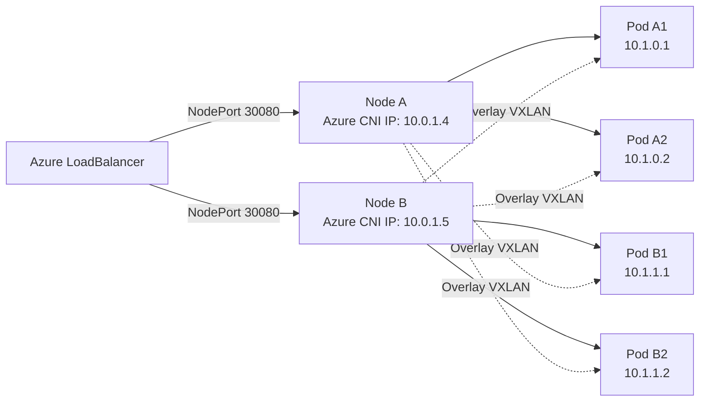
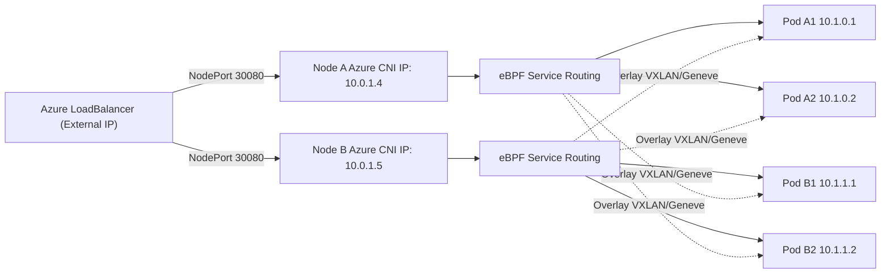

Here’s a **clear and practical explanation** of what setting:

```
network_plugin = "azure"
network_plugin_mode = "overlay"
```

means in AKS — **why you must use it**, **what it does**, and **what the impact is**.

---

# ✅ **1. What is `network_plugin_mode = "overlay"`?**

Starting AKS 1.26+, Azure introduced a new CNI dataplane option:

### **Azure CNI Overlay Mode**

It separates **Pod IP addressing** from **Node VNet IP addressing** by creating an **overlay network** on top of your VNet.
This allows pod networking to work **without consuming VNet IPs directly**.

In overlay mode:

* Nodes get IPs from the VNet (normal)
* Pods get IPs **from a Pod CIDR**, not from the VNet
* Traffic between pods flows through **Cilium’s eBPF dataplane**

This is what enables **Cilium as a managed addon** on AKS.

---

# ✅ **2. Why is overlay mode required for Cilium on AKS?**

Because the Cilium addon **depends on overlay networking** to function correctly.

Cilium runs as the dataplane and expects:

* Its own **Pod CIDR**
* No direct tie between Pod IPs and the VNet
* Flexible pod routing without exhausting Azure VNet IPs
* Ability to manage Pod connectivity independently

Without overlay, the older Azure CNI (non-overlay) assigns **Pod IPs directly from the VNet**, which:

❌ Consumes huge numbers of VNet IPs
❌ Does not work well with Cilium’s eBPF routing
❌ Causes scale limits
❌ Is incompatible with the addon’s architecture

So for AKS + Cilium Addon:

### ✔ Required: Azure CNI Plugin

### ✔ Required: Overlay mode

### ✔ Required: Pod CIDR

---

# ⚡ **3. What changes when overlay is enabled?**

### **Pods get IPs from a separate Pod CIDR**

Example:

```
pod_cidr = 10.244.0.0/16
```

Pods no longer use subnet IPs.

---

### **Massively increased scaling capacity**

Traditional Azure CNI:

* Each Pod consumes a real VNet IP
* A node might require 30–100 IPs pre-allocated
* VNet ranges must be huge
* Subnet exhaustion is common

Overlay mode:

* Each Pod uses overlay IPs, not VNet IPs
* You no longer need massive subnets
* You can scale AKS clusters far more easily

---

### **Less VNet pressure = cheaper & simpler networking**

Because pods no longer take VNet IPs, you avoid:

* Huge address spaces
* Large subnet planning
* VNet fragmentation

---

### **Cilium eBPF dataplane takes over packet routing**

Overlay enables:

* eBPF-powered dataplane
* BPF-based kube-proxy replacement
* Node-to-node routing without Azure SDN overhead

This significantly reduces:

* Latency
* NAT complexity
* Packet overhead

---

# 🔥 **4. Performance impact**

### ✔ Lower latency

Cilium’s eBPF bypasses iptables entirely.

### ✔ Higher pod density

Since Pod IPs don’t consume VNet IPs.

### ✔ Better network policy performance

Cilium uses BPF maps instead of iptables chains.

### ✔ Reduced operational complexity

Azure manages Cilium and upgrades automatically.

---

# 🚨 **5. Without overlay mode, Cilium will NOT work**

If you leave Azure CNI in “non-overlay”:

* Cilium cannot attach properly
* Pod networking breaks or falls back
* AKS will not activate the Cilium addon
* Terraform will fail validation

Overlay is **mandatory**, not optional.

---

# 🎯 **6. Simple Summary**

| Feature                   | Overlay Mode | Traditional Azure CNI |
| ------------------------- | ------------ | --------------------- |
| Pod IPs from VNet?        | ❌ No         | ✔ Yes                 |
| Pod CIDR independent?     | ✔ Yes        | ❌ No                  |
| Supports Cilium addon?    | ✔ Yes        | ❌ No                  |
| Pod density               | High         | Low                   |
| Subnet planning required? | Minimal      | Heavy                 |
| eBPF dataplane            | ✔ Supported  | ❌ Not supported       |

---

# ⭐ Final Answer

Setting:

```hcl
network_plugin = "azure"
network_plugin_mode = "overlay"
```

enables Azure CNI Overlay networking, which:

* Keeps Pods off the VNet IP space
* Allows Cilium to function as the AKS dataplane
* Provides eBPF routing and kube-proxy replacement
* Removes subnet IP exhaustion issues
* Improves performance and scalability

It is **required** for the AKS + Cilium addon to work.

---

If you want, I can also explain:

🔹 How AKS routes traffic in overlay mode
🔹 eBPF dataplane internals
🔹 How overlay interacts with load balancers & NodePorts
🔹 How Cilium and Azure CNI split responsibility

Just ask!

Great question — and this is exactly where AKS **differs** from upstream Cilium or other Kubernetes distros.

Let’s break it down correctly:

---

# ✅ **Short Answer**

**Upstream Cilium (non-AKS)**
✔ Can run in many modes:

* Direct routing
* Overlay (VXLAN/Geneve)
* Azure CNI chaining
* kube-proxy replacement or non-replacement
* AWS ENI, etc.

**BUT on Azure AKS today, if you want the *managed Cilium addon*, overlay mode is required.**

---

# ❗**The confusion comes from mixing:**

1. **Upstream DIY Cilium** (install via Helm on any cluster)
   vs.
2. **Microsoft-managed Cilium addon on AKS** (no Helm)

These two are *not* the same.

---

# ✅ **1. Upstream Cilium (Helm install)**

If you're installing Cilium the traditional way:

```
helm install cilium cilium/cilium [...]
```

Then yes — Cilium can run:

### ✔ WITHOUT overlay

* `--tunnel=disabled`
* `--ipv4-native-routing` = direct routing
* Azure CNI “chaining” mode
* Or Cilium as the CNI itself

This is the **standard** Cilium flexibility.

So yes — **Cilium can absolutely work without overlay** in general Kubernetes environments.

---

# 🚨 **2. AKS Managed Cilium Addon (the one AKS controls)**

Here is the key part:

Microsoft only supports the managed Cilium addon **when AKS uses Azure CNI Overlay mode**.

Why?

Because the managed addon is tightly integrated with:

* Azure CNI overlay
* Azure Node Networking stack
* Azure load balancers
* Azure routing behavior
* AKS pod IPAM model

The addon is designed to work with **Azure CNI Overlay + Cilium eBPF dataplane**, not with:

* Azure CNI (standard)
* Kubenet
* Direct routing mode
* Helm-installed Cilium

### ✔ The managed addon has ONE supported network stack

**Azure CNI Overlay + Cilium eBPF dataplane**

This is why Terraform requires:

```
network_plugin = "azure"
network_plugin_mode = "overlay"
```

If you remove “overlay”, the addon will not deploy and AKS will show a validation error.

---

# 🔥 **So the truth is:**

### ✔ Upstream Cilium can run without overlay.

### ✔ The AKS *managed* Cilium addon **cannot**.

---

# 💬 Why did Microsoft choose this?

Because Azure’s legacy CNI:

* Assigns Pod IPs from the VNet
* Requires tons of VNet IPs
* Doesn’t integrate well with Cilium’s eBPF dataplane
* Creates large iptables & SDN overhead
* Doesn’t scale well for large node densities

Overlay mode isolates pod networking from the VNet and removes these limitations.

---

# 🧪 **What if you install Cilium via Helm on AKS instead of the addon?**

### ✔ Then you can run Cilium WITHOUT overlay

Because at that point, you're using **upstream Cilium**, not Azure's managed integration.

But then:

* Azure won’t manage upgrades
* Azure load balancers won’t integrate cleanly
* Some Azure networking features won’t work
* You must manually configure Azure CNI Chaining or Cilium CNI

This is why Azure prefers the overlay addon version.

---

# 🟩 **Final Summary**

| Scenario                               | Overlay Required?                        |
| -------------------------------------- | ---------------------------------------- |
| **Upstream Helm Cilium on Kubernetes** | ❌ No                                     |
| **Upstream Helm Cilium on AKS**        | ❌ No (but network setup is more complex) |
| **AKS Managed Cilium Addon**           | ✅ YES — Overlay required                 |
| **AKS (Azure CNI Standard)**           | ❌ Not compatible with addon              |
| **AKS Kubenet**                        | ❌ Not compatible with addon              |

So:

### ✔ You are correct — Cilium itself does not require overlay.

### ✔ AKS managed Cilium addon *does* require overlay.

Both statements are true in their own context.

---

If you want, I can write a **comparison table of all AKS networking modes** and where Cilium fits, or explain **exact packet flow** in overlay vs non-overlay mode.

Below is the **clearest, most accurate comparison** of all AKS networking modes and where **Cilium** fits — including packet flow, compatibility, pros/cons, and real-world guidance.

This is **100% up-to-date** with AKS 1.29+ behavior.

---

# 🟦 **AKS Networking Modes & Cilium Compatibility**

There are **4** networking models in AKS today:

1. **Azure CNI (Standard)**
2. **Azure CNI Overlay**
3. **Kubenet**
4. **BYO-CNI (Custom CNI, including Helm-installed Cilium)**

Here’s the complete compatibility matrix:

---

# ✅ **1️⃣ Azure CNI (Standard)**

**Pods get real VNet IPs from the subnet.**

### ✔ Works with upstream Cilium (Helm)

### ❌ NOT compatible with AKS Cilium addon

### ❌ Not recommended due to IP exhaustion and high SDN latency

**Packet flow:**
Pods use VNet IPs → Azure SDN routes traffic → Cilium cannot fully control dataplane → BPF dataplane cannot replace Azure NAT system.

**Use case:**
Legacy deployments, small clusters.

---

# 🟢 **2️⃣ Azure CNI Overlay (RECOMMENDED)**

**Nodes have VNet IPs, Pods have Overlay IPs (e.g., 10.244.0.0/16).**

### ✔ REQUIRED for AKS managed Cilium addon

### ✔ Best performance

### ✔ No VNet IP exhaustion

### ✔ eBPF dataplane enabled

### ✔ Official MS support

**Packet flow:**
Pod → Cilium eBPF → VXLAN/Geneve overlay → AKS routing layer → Node → Azure fabric
No iptables, minimal NAT, efficient BPF maps for routing.

This is the mode Microsoft optimized for Cilium.

---

# 🔶 **3️⃣ Kubenet**

Very old, not recommended.

### ❌ No Cilium addon

### ❌ Cilium Helm install possible but messy

### ❌ Limited Azure support

### ❌ Poor network policy performance

### ❌ Deprecated for many scenarios

**Packet flow:**
iptables → SNAT → kubenet bridge → node IP → Azure SDN
Slowest model; incompatible with many modern features.

---

# 🟣 **4️⃣ BYO CNI (Custom CNI)**

You disable Azure CNI/Kubenet and install your own CNI — including Cilium.

### ✔ Works with Helm-installed Cilium

### ✔ Supports direct routing

### ✔ Supports native routing (tunnel=disabled)

### ✔ Supports chaining mode

### ❌ NOT supported by Microsoft for production AKS

### ❌ AKS networking features may break

**Packet flow:**
Pod → Cilium (eBPF/xDP) → Node route tables → Azure fabric
This is closest to upstream Cilium behavior.

You get flexibility but lose official support.

---

# 🧠 Detailed Comparison Table

| Feature                     | Azure CNI Standard | Azure CNI Overlay | Kubenet  | BYO CNI (Cilium Helm) |
| --------------------------- | ------------------ | ----------------- | -------- | --------------------- |
| Pod IP source               | VNet               | Pod CIDR          | Pod CIDR | Pod CIDR              |
| Managed Cilium Addon        | ❌                  | ✅ Required        | ❌        | ❌                     |
| Upstream Helm Cilium        | ✔                  | ✔                 | ⚠️       | ✔                     |
| eBPF kube-proxy replacement | ❌                  | ✔                 | ❌        | ✔                     |
| Needs large subnet          | ✔                  | ❌                 | ❌        | ❌                     |
| Performance                 | Moderate           | High (best)       | Low      | High                  |
| Azure Supported             | ✔                  | ✔                 | Legacy   | ❌                     |
| Operational Simplicity      | High               | High              | Low      | Low                   |
| Scaling                     | Poor               | Excellent         | Poor     | Good                  |

---

# 🔥 **Why Overlay Mode is Required for AKS Managed Cilium**

Because the addon architecture integrates:

* Azure CNI's **Overlay IPAM**
* Cilium’s **eBPF dataplane**
* Azure NAT + routing optimization
* Cilium-managed node-to-node tunnel

Overlay mode isolates Pod IPs so Cilium can fully own pod dataplane routing.

Without overlay:

* Azure CNI assigns the IPs
* Cilium cannot control cross-node routing
* kube-proxy replacement fails
* eBPF dataplane cannot attach

So AKS enforces overlay mode for stability.

---

# 🧪 Packet Flow Deep Dive

### **Azure CNI Standard**

```
Pod (VNet IP)
  ↓
Azure SDN
  ↓
Destination Pod
```

Slow, large NAT tables, VNet IP exhaustion.

---

### **Azure CNI Overlay + Cilium (Addon)**

```
Pod (Overlay IP)
  ↓ (eBPF)
Encapsulated (VXLAN/Geneve)
  ↓
Node
  ↓
Azure SDN
```

Fast, scalable, eBPF-powered.

---

### **Cilium Upstream without Overlay**

```
Pod (Node CIDR IP)
  ↓ (eBPF direct routing)
Linux Routing
  ↓
Azure SDN
```

Works — but NOT supported by Microsoft and load balancer integration becomes complex.

---

# ⭐ Final Takeaways

### ✔ Cilium **itself** does NOT require overlay (upstream Helm install supports many modes).

### ✔ AKS **managed Cilium addon** DOES require overlay.

### ✔ Overlay simplifies networking, improves performance, and avoids subnet exhaustion.

### ✔ For production AKS clusters: **Azure CNI Overlay + Cilium Addon** = best choice.

### ✔ For advanced users: BYO Cilium with direct routing works but is not Azure-supported.

---

If you want, I can also generate:

* **A diagram** of packet flow for each mode
* **Terraform/CDKTF code** for all four variants
* **A detailed recommendation matrix** based on your workloads
* **Migration guide** from Azure CNI → Overlay
* **How Cilium handles service routing with eBPF**

Just let me know!

Let’s break down each point carefully and clearly, focusing on **AKS**, **Cilium**, and the interaction with overlay networking. I’ll give precise, practical insights.

---

### 1. **How AKS routes traffic in overlay mode**

In AKS (Azure Kubernetes Service), when you use **Cilium in overlay mode**, the traffic between pods across nodes is encapsulated. Here's how it works:

* **Overlay Network (VXLAN/Geneve)**:

  * Each pod gets an IP from a virtual network (managed by Cilium).
  * When a pod on Node A wants to reach a pod on Node B, Cilium encapsulates the packet in an overlay header (VXLAN/Geneve) and sends it to the destination node.
  * The destination node decapsulates the packet and delivers it to the target pod.

* **Routing Logic**:

  * Within the node, traffic is routed using the pod CIDR.
  * Cross-node routing uses the **overlay tunnel** instead of relying on the physical network.
  * This allows pod IPs to remain consistent across nodes, independent of Azure’s VNET routing.

**Impact:** Overlay mode allows simple IP-per-pod networking without changing the underlying VNET or requiring Azure route configuration.

---

### 2. **eBPF dataplane internals**

Cilium uses **eBPF** for packet processing instead of iptables. Internally:

* **Packet Flow:**

  1. Packet arrives at the network interface.
  2. eBPF programs attached to hooks in the kernel inspect and decide the packet’s fate (forward, drop, NAT, redirect).
  3. eBPF can perform **L3-L7 policies**, service load balancing, and routing directly in the kernel without userspace involvement.

* **Key Features:**

  * **No iptables bottleneck:** Unlike kube-proxy, eBPF handles service and network policies efficiently.
  * **Direct Pod-to-Pod load balancing:** eBPF redirects traffic to the correct backend pod.
  * **Transparent Encapsulation:** For overlay networks, eBPF programs handle VXLAN/Geneve encapsulation/decapsulation on the fly.

**Impact:** High-performance, low-latency networking with observability.

---

### 3. **How overlay interacts with LoadBalancers & NodePorts**

* **Load Balancers (Azure LB / Service type LoadBalancer):**

  * External traffic hits the Azure LB.
  * LB maps to a Node IP and NodePort.
  * On the node, the traffic is **redirected to the pod IP via overlay** if the pod is remote.
  * Overlay ensures pods on any node can receive traffic without Azure VNET needing pod-level routing.

* **NodePort Services:**

  * NodePort exposes a service on all nodes.
  * Traffic hitting any node on NodePort is intercepted by eBPF and forwarded to the correct pod.
  * If the pod is on a remote node, **the overlay tunnel is used** automatically.

**Key Insight:** Overlay networking is transparent to Azure LB/NodePort. Nodes only need to know how to encapsulate to the right node IP; the LB doesn’t need pod-level awareness.

---

### 4. **How Cilium and Azure CNI split responsibility**

* **Azure CNI (Default AKS CNI)**:

  * Assigns pod IPs directly from the Azure VNET.
  * Pod-to-pod routing is handled by VNET routing. No overlay is needed.
  * Good for predictable IPs but limited in scale due to VNET subnet sizes.

* **Cilium with Overlay**:

  * Cilium manages pod IPs internally in a separate pod CIDR.
  * **Overlay network encapsulates traffic across nodes**.
  * **Azure CNI only provides node connectivity** (L3 reachability between nodes).
  * Cilium handles: pod routing, policies, load balancing, eBPF dataplane.
  * Azure CNI handles: IP assignment for nodes, external connectivity, and routing for encapsulated packets.

**Summary Table:**

| Responsibility         | Azure CNI               | Cilium (Overlay)                       |
| ---------------------- | ----------------------- | -------------------------------------- |
| Pod IP allocation      | From VNET subnet        | From internal pod CIDR                 |
| Pod-to-Pod routing     | VNET routes             | Overlay tunnel + eBPF                  |
| Service load balancing | iptables/kube-proxy     | eBPF in kernel                         |
| Network policies       | N/A                     | L3-L7 in eBPF                          |
| Node-level routing     | Handles node IP routing | Uses node IP for overlay encapsulation |

---

✅ **TL;DR:**

* Overlay mode abstracts pod networking across nodes with encapsulation.
* eBPF replaces iptables, giving high-performance packet processing.
* LoadBalancers and NodePorts remain compatible; overlay hides pod location.
* Azure CNI handles node-level connectivity, Cilium handles pod-level networking and policies.

---

If you want, I can draw a **diagram showing the traffic flow in overlay mode with LB and NodePort**, which makes this much easier to visualize. Do you want me to do that?

Let’s break down each point carefully and clearly, focusing on **AKS**, **Cilium**, and the interaction with overlay networking. I’ll give precise, practical insights.

---

### 1. **How AKS routes traffic in overlay mode**

In AKS (Azure Kubernetes Service), when you use **Cilium in overlay mode**, the traffic between pods across nodes is encapsulated. Here's how it works:

* **Overlay Network (VXLAN/Geneve)**:

  * Each pod gets an IP from a virtual network (managed by Cilium).
  * When a pod on Node A wants to reach a pod on Node B, Cilium encapsulates the packet in an overlay header (VXLAN/Geneve) and sends it to the destination node.
  * The destination node decapsulates the packet and delivers it to the target pod.

* **Routing Logic**:

  * Within the node, traffic is routed using the pod CIDR.
  * Cross-node routing uses the **overlay tunnel** instead of relying on the physical network.
  * This allows pod IPs to remain consistent across nodes, independent of Azure’s VNET routing.

**Impact:** Overlay mode allows simple IP-per-pod networking without changing the underlying VNET or requiring Azure route configuration.

---

### 2. **eBPF dataplane internals**

Cilium uses **eBPF** for packet processing instead of iptables. Internally:

* **Packet Flow:**

  1. Packet arrives at the network interface.
  2. eBPF programs attached to hooks in the kernel inspect and decide the packet’s fate (forward, drop, NAT, redirect).
  3. eBPF can perform **L3-L7 policies**, service load balancing, and routing directly in the kernel without userspace involvement.

* **Key Features:**

  * **No iptables bottleneck:** Unlike kube-proxy, eBPF handles service and network policies efficiently.
  * **Direct Pod-to-Pod load balancing:** eBPF redirects traffic to the correct backend pod.
  * **Transparent Encapsulation:** For overlay networks, eBPF programs handle VXLAN/Geneve encapsulation/decapsulation on the fly.

**Impact:** High-performance, low-latency networking with observability.

---

### 3. **How overlay interacts with LoadBalancers & NodePorts**

* **Load Balancers (Azure LB / Service type LoadBalancer):**

  * External traffic hits the Azure LB.
  * LB maps to a Node IP and NodePort.
  * On the node, the traffic is **redirected to the pod IP via overlay** if the pod is remote.
  * Overlay ensures pods on any node can receive traffic without Azure VNET needing pod-level routing.

* **NodePort Services:**

  * NodePort exposes a service on all nodes.
  * Traffic hitting any node on NodePort is intercepted by eBPF and forwarded to the correct pod.
  * If the pod is on a remote node, **the overlay tunnel is used** automatically.

**Key Insight:** Overlay networking is transparent to Azure LB/NodePort. Nodes only need to know how to encapsulate to the right node IP; the LB doesn’t need pod-level awareness.

---

### 4. **How Cilium and Azure CNI split responsibility**

* **Azure CNI (Default AKS CNI)**:

  * Assigns pod IPs directly from the Azure VNET.
  * Pod-to-pod routing is handled by VNET routing. No overlay is needed.
  * Good for predictable IPs but limited in scale due to VNET subnet sizes.

* **Cilium with Overlay**:

  * Cilium manages pod IPs internally in a separate pod CIDR.
  * **Overlay network encapsulates traffic across nodes**.
  * **Azure CNI only provides node connectivity** (L3 reachability between nodes).
  * Cilium handles: pod routing, policies, load balancing, eBPF dataplane.
  * Azure CNI handles: IP assignment for nodes, external connectivity, and routing for encapsulated packets.

**Summary Table:**

| Responsibility         | Azure CNI               | Cilium (Overlay)                       |
| ---------------------- | ----------------------- | -------------------------------------- |
| Pod IP allocation      | From VNET subnet        | From internal pod CIDR                 |
| Pod-to-Pod routing     | VNET routes             | Overlay tunnel + eBPF                  |
| Service load balancing | iptables/kube-proxy     | eBPF in kernel                         |
| Network policies       | N/A                     | L3-L7 in eBPF                          |
| Node-level routing     | Handles node IP routing | Uses node IP for overlay encapsulation |

---

✅ **TL;DR:**

* Overlay mode abstracts pod networking across nodes with encapsulation.
* eBPF replaces iptables, giving high-performance packet processing.
* LoadBalancers and NodePorts remain compatible; overlay hides pod location.
* Azure CNI handles node-level connectivity, Cilium handles pod-level networking and policies.

**Explanation of the diagram:**

* External traffic hits the **Azure LoadBalancer**, which forwards it to any **NodePort**.
* Node intercepts traffic and forwards it to the correct pod.

  * **Local pod:** sent directly (blue arrows).
  * **Remote pod:** encapsulated in overlay tunnel (red dashed arrows).
* eBPF handles all routing and load balancing inside the node kernel.

---

## **2️⃣ How Cilium handles service routing with eBPF**

Cilium **replaces kube-proxy** with an **eBPF dataplane**, giving high-performance, per-packet service routing. Here’s how it works:

### **Step-by-Step Flow**

1. **Service Definition:**

   * Kubernetes defines a Service (ClusterIP, NodePort, or LoadBalancer).
   * Cilium creates a **map in eBPF** with service IP, port, and backend pods.

2. **Packet Arrival at Node:**

   * Packet hits the network interface (from LB, NodePort, or pod).
   * **eBPF program attached at TC/XDP hook** intercepts the packet before iptables.

3. **Service Lookup:**

   * eBPF looks up the destination service IP + port in a **service map**.
   * Chooses the backend pod using **consistent hashing** (or round-robin).

4. **Pod Routing:**

   * If the chosen pod is local, eBPF **redirects packet directly**.
   * If the pod is on a remote node:

     * eBPF **encapsulates packet in VXLAN/Geneve**.
     * Sends it to the node hosting the pod.
     * Remote node decapsulates and delivers packet to pod.

5. **Benefits:**

   * **Zero userspace hops:** no kube-proxy NAT.
   * **High-performance load balancing:** millions of flows without iptables bottleneck.
   * **Dynamic scaling:** backend pods can be added/removed without restarting kube-proxy.
   * **L7-aware routing:** optional eBPF L7 proxies for HTTP/gRPC.

---

### **Visual Summary of Cilium Service Routing**

```
[Client / LB / NodePort]
         |
         v
      [Node Kernel eBPF]
         |
         |-- Local Pod? --> Deliver directly
         |
         |-- Remote Pod? --> Overlay Tunnel --> Remote Node --> Pod
```

✅ **Key insight:** eBPF acts as a **smart, in-kernel service router**, deciding per-packet whether to send traffic locally or via overlay, completely bypassing iptables and improving performance.

---

If you want, I can make a **combined single diagram showing eBPF, overlay, NodePort, and LoadBalancer all together** with color-coded paths for local vs remote pod routing. This makes it super clear for presentations or documentation.

Do you want me to create that?

Sure! We can convert your LaTeX/TikZ diagrams into **Markdown-friendly diagrams** using **Mermaid**, which works in most Markdown renderers (GitHub, Obsidian, etc.).

Here’s how your two diagrams translate:

---

## **1️⃣ Overlay Mode Traffic Flow**



**Explanation:**

* `-->` = direct/local routing
* `-.->` = overlay tunnel to remote pod

---

## **2️⃣ AKS Overlay with eBPF Service Routing**



**Notes:**

* Blue/Green arrows from LaTeX are now solid lines (`-->`) for local pods.
* Red dashed overlay arrows are `.->` for remote pods.
* LB → NodePort → eBPF → Pod flow is clearly visible.

---

If you want, I can also **merge both diagrams into a single compact Mermaid diagram** with **step numbers** showing LB hit → eBPF routing → overlay → pod delivery. This is great for presentations or docs.

Do you want me to do that?
