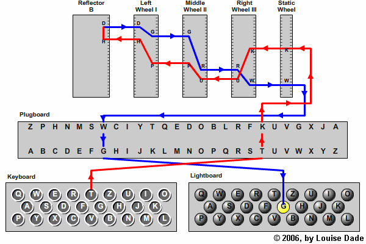

# Enigma

<!-- TOC -->

- [Enigma](#enigma)
  - [Basic information](#basic-information)
    - [Description](#description)
    - [What is a "Enigma Machine"](#what-is-a-enigma-machine)
    - [How does it work](#how-does-it-work)
  - [Usage](#usage)
    - [Command-line application](#command-line-application)
    - [API](#api)
    - [Caveats](#caveats)
  - [References](#references)
  - [License](#license)

<!-- /TOC -->

## Basic information

### Description

A simple enigma machine in Go. This is just a toy project to play a bit more with [Go](https://golang.org/) and it's tools, dependency management, and all that.

The main objective is to emulate a "generic" M3/M4 Enigma (the most known/used model in the War), in the command line.

### What is a "Enigma Machine"

According to [Wikipedia](https://en.wikipedia.org/wiki/Enigma_machine),

> The Enigma machines were a series of electro-mechanical rotor cipher machines developed and used in the early- to mid-20th century to protect commercial, diplomatic and military communication. Enigma was invented by the German engineer Arthur Scherbius at the end of World War I. Early models were used commercially from the early 1920s, and adopted by military and government services of several countries, most notably Nazi Germany before and during World War II. Several different Enigma models were produced, but the German military models, having a plugboard, were the most complex. Japanese and Italian models were also in use.

It was, basically, a machine used to encode military messages on WWII. It has an interesting history and emultating it serves as a fun programming exercise.

### How does it work

Some people belive that an image is worth a thousand words. If that is the case, the followin diagram
(stolen from [here](http://enigma.louisedade.co.uk/howitworks.html)) sums up pretty well how such a machine
works:

Basically, the input travels from the keyboard to the plugboard and then, to each rotor, ultil it reaches the reflector (red arrow). After that, the signal bounces on the opposite path, until it reaches the lightboard (blue arrow). Not that complicated, right?

## Usage

### Command-line application

Simply running the executable is enough to start the application with a default set of options (use `--help`) to see all the flags available. By default, the coded text is written to `STDOUT` after every newline. You can change this behavior using the `-o` flag, e. g. `enigma -o coded.txt`.

You can also encode an entire file in one go by piping it to the application: `cat plain.txt | enigma -q > coded.txt`.

### API

There are basically two ways to use the API. The first one, in the package [enigma](https://godoc.org/github.com/ibraimgm/enigma/machine/enigma) exports an easy-to-use built-int enigma machine, with configurable rotors, ring settings and window settings. It is also possible to use the [Assemble](https://godoc.org/github.com/ibraimgm/enigma/machine/enigma#Assemble) funcion to specify
every individual part of the machine.

The second package, [parts](https://godoc.org/github.com/ibraimgm/enigma/machine/parts), contains the interfaces for every machine part used by the enigma, with default implementations as well.

### Caveats

This implementation is a bit more 'flexible' than the actual enigma hardware. For example, you can use the same rotor  more than once all rotors are valid in all positions, etc. This is intentional to make the API and machine construction as flexible as possible.

## References

These are the main references/documentation used in this project:

- [How Enigma Machines Work](http://enigma.louisedade.co.uk/howitworks.html)
- [An example of the basic Enigma](https://www.codesandciphers.org.uk/enigma/example1.htm)
- [Working principle of the Enigma](http://www.cryptomuseum.com/crypto/enigma/working.htm)
- [Enigma cipher algorithm](http://practicalcryptography.com/ciphers/enigma-cipher/)
- [Universal Enigma](http://people.physik.hu-berlin.de/~palloks/js/enigma/enigma-u_v20_en.html), for checking
- [M3/M4 Enigma emulator](http://enigma.louisedade.co.uk/enigma.html), also used for checking

## License

MIT. Take a look at the `LICENSE` file.
