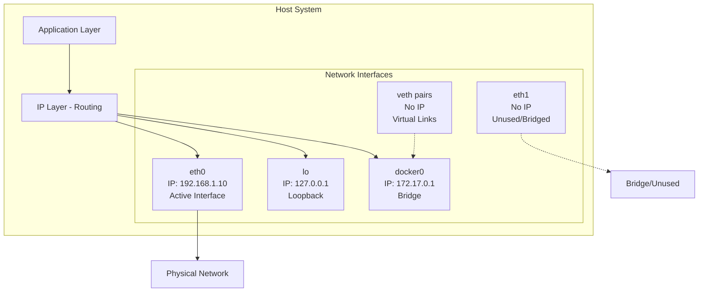
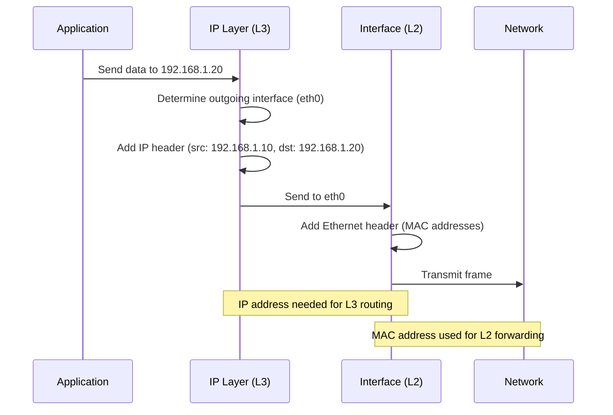

# Network Interfaces and IP Addressing: A Detailed Explanation

## Why Not Every Interface Has an IP Address

**No, not every network interface requires an IP address.** Whether an interface needs an IP address depends on its purpose and how it operates in the network stack.

## Understanding Network Interfaces

A network interface is a software or hardware component that connects your computer to a network. There are several types:

### 1. **Physical Interfaces** (e.g., eth0, eth1, wlan0)
- Represent actual hardware (Ethernet NICs, Wi-Fi adapters)
- May or may not have IP addresses depending on their role

### 2. **Virtual Interfaces** (e.g., lo, docker0, veth pairs)
- Software-created interfaces
- Serve various purposes in the networking stack

### 3. **Bridge Interfaces** (e.g., br0, virbr0)
- Layer 2 devices that connect multiple interfaces
- Often don't need IP addresses unless they're being used as a gateway

## Why Only eth0 Might Have an IP Address


<!-- 
 style C fill:#90EE90
    style D fill:#FFB6C1
    style E fill:#87CEEB
    style F fill:#DDA0DD
    style G fill:#F0E68C -->
## Scenarios Where Interfaces Don't Need IP Addresses

### 1. **Layer 2 Bridging**
```
eth0 (no IP) ----\
                  |---- br0 (192.168.1.10)
eth1 (no IP) ----/
```
When interfaces are bridged, they operate at Layer 2 (MAC address level). The bridge itself gets the IP address, not the member interfaces.

### 2. **Port Bonding/Link Aggregation**
```
eth0 (no IP) ----\
                  |---- bond0 (192.168.1.10)
eth1 (no IP) ----/
```
Multiple physical interfaces combined into a single logical interface. Only the bond interface needs an IP.

### 3. **Virtual Ethernet Pairs (veth)**
```
Container Namespace          Host Namespace
[eth0 in container] <----> [veth12345 - no IP needed]
                                    |
                                    v
                               [docker0 bridge]
```
veth interfaces connect namespaces. They're like virtual cables and don't need IPs themselves.

### 4. **Monitoring/Promiscuous Mode**
An interface can be configured in promiscuous mode for packet capture without an IP address.

### 5. **Unused Interfaces**
An interface that exists but isn't being used simply won't have an IP configured.

## How IP Addressing Works

### Layer 2 vs Layer 3 Operations



### Key Concepts:

1. **IP addresses operate at Layer 3 (Network Layer)**
   - Used for routing between networks
   - Logical addressing

2. **Network interfaces operate at Layer 2 (Data Link Layer)**
   - Use MAC addresses for local delivery
   - Physical addressing

3. **An interface needs an IP address when:**
   - It's the source or destination of IP traffic
   - It needs to route packets
   - It's acting as a gateway

4. **An interface doesn't need an IP address when:**
   - It's only forwarding frames at Layer 2
   - It's part of a bridge or bond
   - It's a virtual cable (veth pair)
   - It's unused or in a special mode

## Common Configuration Examples

### Example 1: Simple Host
```
eth0: 192.168.1.10/24  (primary network interface)
lo:   127.0.0.1/8      (loopback - always present)
```

### Example 2: Docker Host
```
eth0:    192.168.1.10/24  (host network)
lo:      127.0.0.1/8      (loopback)
docker0: 172.17.0.1/16    (docker bridge)
veth1:   (no IP - connects container to docker0)
veth2:   (no IP - connects container to docker0)
```

### Example 3: Network Bridge
```
br0:  192.168.1.10/24  (bridge with IP)
eth0: (no IP - bridge member)
eth1: (no IP - bridge member)
tap0: (no IP - VM interface, bridge member)
```

## Why This Design Makes Sense

1. **Efficiency**: Not every interface needs Layer 3 addressing
2. **Flexibility**: Interfaces can serve different purposes
3. **Network Topology**: Some interfaces are just virtual cables
4. **Abstraction**: Separates Layer 2 and Layer 3 functions

## Checking Your Interfaces

You can check your interfaces with:
```bash
# Show all interfaces with their IP addresses
ip addr show

# Show only interface names
ip link show

# Legacy command
ifconfig -a
```

## Summary

**eth0 typically has an IP address because it's your primary network interface that communicates with external networks.** Other interfaces may not need IP addresses because they serve different purposes: they might be unused, part of a bridge, virtual links between namespaces, or monitoring interfaces. The key principle is that **IP addresses are only needed when an interface participates in Layer 3 (IP) routing decisions**, not for all Layer 2 forwarding operations.