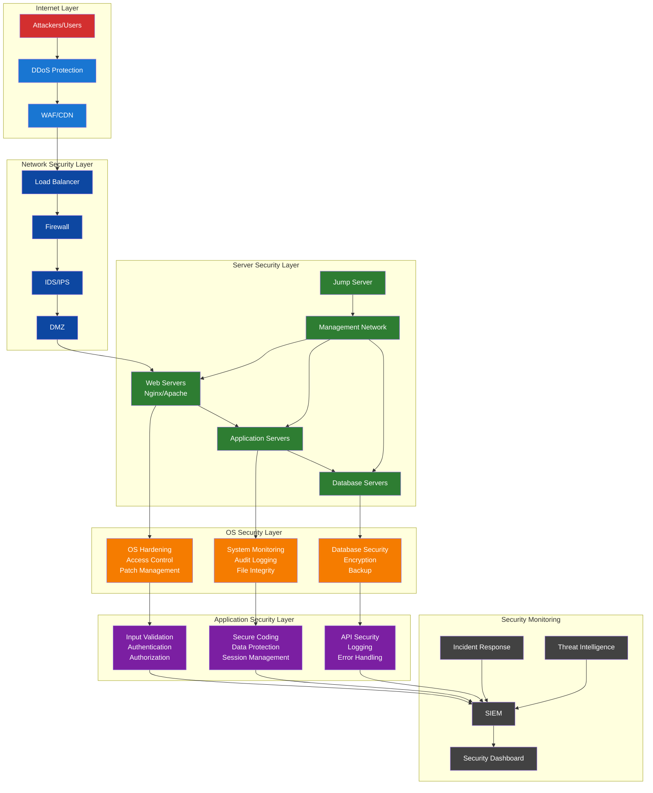
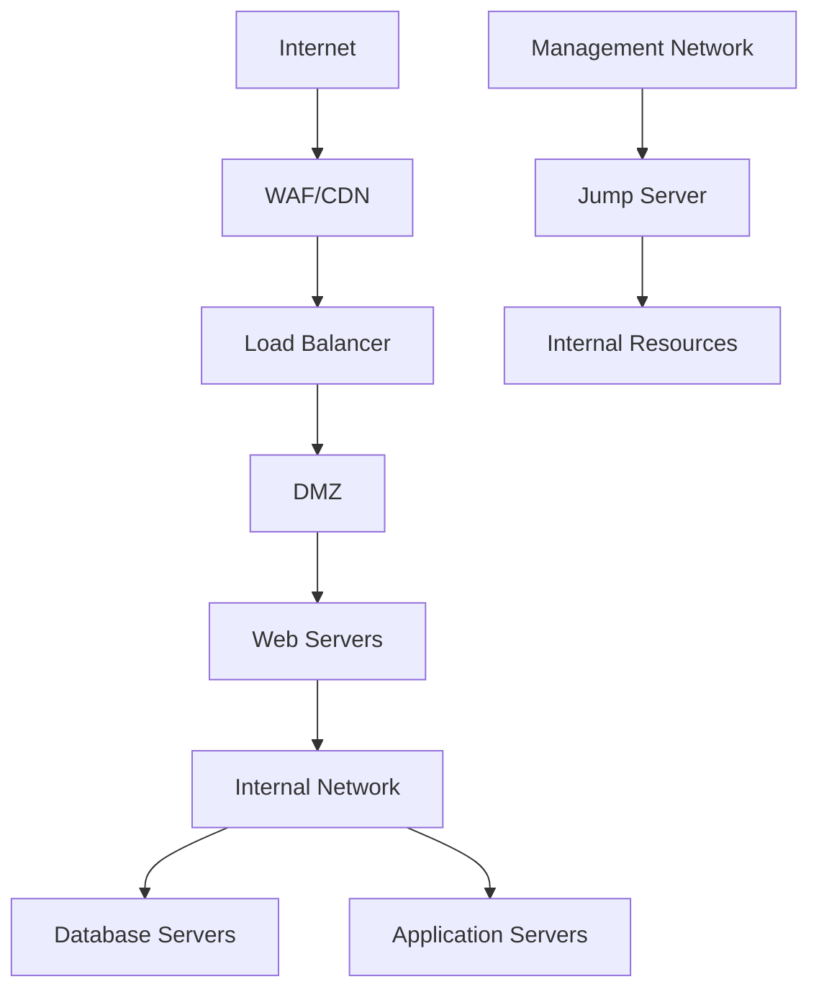

# Secure Web Application Design
## Multi-Layer Security Architecture

### Executive Summary
This document outlines a comprehensive security design for a web application from four critical perspectives: Server, Network, Operating System, and Application layers. Each layer implements defense-in-depth strategies to prevent exploitation and attacks.

### Security Architecture Overview


---

## 1. SERVER SECURITY LAYER

### 1.1 Physical Security
- **Data Center Security**: Biometric access controls, 24/7 monitoring, environmental controls
- **Hardware Security**: TPM modules, secure boot processes, hardware-based encryption
- **Asset Management**: Inventory tracking, lifecycle management, secure disposal

### 1.2 Server Hardening
```yaml
Server Configuration:
  - Minimal OS installation (remove unnecessary services)
  - Disable unused ports and services
  - Regular security patching schedule
  - Secure time synchronization (NTP)
  - Log monitoring and centralization
  - Intrusion detection systems (HIDS)
```

### 1.3 Web Server Configuration (Nginx/Apache)
```nginx
# Nginx Security Configuration
server {
    # Hide server version
    server_tokens off;
    
    # Security headers
    add_header X-Frame-Options DENY;
    add_header X-Content-Type-Options nosniff;
    add_header X-XSS-Protection "1; mode=block";
    add_header Strict-Transport-Security "max-age=31536000; includeSubDomains";
    add_header Content-Security-Policy "default-src 'self'";
    
    # Rate limiting
    limit_req_zone $binary_remote_addr zone=login:10m rate=5r/m;
    limit_req zone=login burst=5 nodelay;
    
    # SSL/TLS Configuration
    ssl_protocols TLSv1.2 TLSv1.3;
    ssl_ciphers ECDHE-RSA-AES256-GCM-SHA512:DHE-RSA-AES256-GCM-SHA512;
    ssl_prefer_server_ciphers off;
    ssl_session_cache shared:SSL:10m;
}
```

### 1.4 Database Security
```sql
-- Database Security Measures
-- 1. Least privilege principle
CREATE USER 'webapp'@'localhost' IDENTIFIED BY 'strong_password';
GRANT SELECT, INSERT, UPDATE ON webapp_db.* TO 'webapp'@'localhost';

-- 2. Connection encryption
REQUIRE SSL;

-- 3. Regular backups with encryption
-- 4. Database firewall rules
-- 5. Query monitoring and logging
```

---

## 2. NETWORK SECURITY LAYER

### 2.1 Network Architecture


### 2.2 Firewall Configuration
```bash
# UFW Firewall Rules
# Default policies
ufw default deny incoming
ufw default allow outgoing

# Web server rules
ufw allow 80/tcp
ufw allow 443/tcp

# SSH (restricted to management network)
ufw allow from 10.0.1.0/24 to any port 22

# Database (internal only)
ufw allow from 10.0.2.0/24 to any port 3306

# Enable logging
ufw logging on
```

### 2.3 Web Application Firewall (WAF)
```yaml
WAF Rules:
  - SQL injection protection
  - XSS filtering
  - CSRF protection
  - Rate limiting by IP/session
  - Geoblocking for high-risk countries
  - Bot protection and CAPTCHA
  - DDoS mitigation
```

### 2.4 Network Monitoring
```yaml
Network Security Tools:
  - IDS/IPS: Suricata with custom rules
  - Network monitoring: Nagios/Zabbix
  - Traffic analysis: Wireshark/ntopng
  - SIEM integration: ELK Stack
  - Threat intelligence feeds
```

---

## 3. OPERATING SYSTEM SECURITY LAYER

### 3.1 OS Hardening (Linux Ubuntu/CentOS)
```bash
#!/bin/bash
# OS Hardening Script

# 1. Update system
apt update && apt upgrade -y

# 2. Disable unnecessary services
systemctl disable bluetooth
systemctl disable cups
systemctl disable avahi-daemon

# 3. Configure secure SSH
sed -i 's/#PermitRootLogin yes/PermitRootLogin no/' /etc/ssh/sshd_config
sed -i 's/#PasswordAuthentication yes/PasswordAuthentication no/' /etc/ssh/sshd_config
echo "AllowUsers webapp-user" >> /etc/ssh/sshd_config

# 4. Configure firewall
ufw enable

# 5. Set up fail2ban
apt install fail2ban -y
systemctl enable fail2ban

# 6. Configure audit logging
apt install auditd -y
systemctl enable auditd
```

### 3.2 Access Control
```yaml
User Management:
  - Principle of least privilege
  - Multi-factor authentication (MFA)
  - Regular access reviews
  - Automated account lockout policies
  - Password complexity requirements
  - Role-based access control (RBAC)
```

### 3.3 System Monitoring
```bash
# Tripwire configuration for file integrity
tripwire --init
tripwire --check

# Log monitoring with rsyslog
echo "*.* @@log-server:514" >> /etc/rsyslog.conf

# Process monitoring
ps aux | grep -E "(apache|nginx|mysql)" > /var/log/process-monitor.log
```

### 3.4 Patch Management
```yaml
Patch Management Strategy:
  - Automated security updates for critical patches
  - Scheduled maintenance windows
  - Testing environment for patch validation
  - Rollback procedures
  - Vulnerability scanning (OpenVAS/Nessus)
```

---

## 4. APPLICATION SECURITY LAYER

### 4.1 Secure Development Practices
```python
# Example: Secure Python Flask Application

from flask import Flask, request, session, escape
from werkzeug.security import generate_password_hash, check_password_hash
import secrets
import re

app = Flask(__name__)
app.secret_key = secrets.token_hex(16)

# Input validation decorator
def validate_input(pattern):
    def decorator(f):
        def wrapper(*args, **kwargs):
            for key, value in request.form.items():
                if not re.match(pattern, value):
                    return "Invalid input", 400
            return f(*args, **kwargs)
        return wrapper
    return decorator

# SQL injection prevention using parameterized queries
def get_user(user_id):
    cursor.execute("SELECT * FROM users WHERE id = %s", (user_id,))
    return cursor.fetchone()

# XSS prevention
@app.route('/profile')
def profile():
    username = escape(session.get('username', ''))
    return f"Welcome {username}"

# CSRF protection
from flask_wtf.csrf import CSRFProtect
csrf = CSRFProtect(app)
```

### 4.2 Authentication & Authorization
```python
# Multi-factor authentication implementation
import pyotp
from flask_login import LoginManager, login_required

class User:
    def __init__(self, username):
        self.username = username
        self.totp_secret = pyotp.random_base32()
    
    def verify_totp(self, token):
        totp = pyotp.TOTP(self.totp_secret)
        return totp.verify(token)

@app.route('/login', methods=['POST'])
def login():
    username = request.form['username']
    password = request.form['password']
    totp_token = request.form['totp']
    
    user = authenticate_user(username, password)
    if user and user.verify_totp(totp_token):
        session['user_id'] = user.id
        return redirect('/dashboard')
    return "Authentication failed", 401
```

### 4.3 Data Protection
```python
# Data encryption and secure storage
from cryptography.fernet import Fernet
import hashlib

class DataProtection:
    def __init__(self):
        self.key = Fernet.generate_key()
        self.cipher = Fernet(self.key)
    
    def encrypt_sensitive_data(self, data):
        """Encrypt PII and sensitive information"""
        return self.cipher.encrypt(data.encode())
    
    def hash_passwords(self, password):
        """Secure password hashing"""
        return generate_password_hash(password, method='pbkdf2:sha256')
    
    def sanitize_output(self, data):
        """Prevent data leakage"""
        # Remove sensitive fields before sending to client
        safe_data = {k: v for k, v in data.items() 
                    if k not in ['password', 'ssn', 'credit_card']}
        return safe_data
```

### 4.4 API Security
```python
# Rate limiting and API security
from flask_limiter import Limiter
from flask_limiter.util import get_remote_address

limiter = Limiter(
    app,
    key_func=get_remote_address,
    default_limits=["1000 per hour"]
)

@app.route('/api/data')
@limiter.limit("10 per minute")
@login_required
def api_endpoint():
    # JWT token validation
    token = request.headers.get('Authorization')
    if not validate_jwt_token(token):
        return "Unauthorized", 401
    
    # Input validation
    if not validate_api_input(request.json):
        return "Invalid input", 400
    
    return jsonify({"data": "secure response"})
```

### 4.5 Logging and Monitoring
```python
import logging
from datetime import datetime

# Security event logging
security_logger = logging.getLogger('security')
handler = logging.FileHandler('/var/log/security.log')
formatter = logging.Formatter('%(asctime)s - %(name)s - %(levelname)s - %(message)s')
handler.setFormatter(formatter)
security_logger.addHandler(handler)

def log_security_event(event_type, user_id, details):
    security_logger.warning(f"SECURITY_EVENT: {event_type} - User: {user_id} - Details: {details}")

# Failed login monitoring
failed_logins = {}

@app.route('/login', methods=['POST'])
def login():
    ip = request.remote_addr
    
    if ip in failed_logins and failed_logins[ip] > 5:
        log_security_event("BRUTE_FORCE_ATTEMPT", None, f"IP: {ip}")
        return "Account locked", 429
    
    # Login logic here
    if not authenticate_user(username, password):
        failed_logins[ip] = failed_logins.get(ip, 0) + 1
        log_security_event("FAILED_LOGIN", username, f"IP: {ip}")
```

---

## 5. SECURITY INTEGRATION & MONITORING

### 5.1 Security Information and Event Management (SIEM)
```yaml
SIEM Configuration:
  Data Sources:
    - Application logs
    - Web server logs
    - Database logs
    - Network traffic
    - System logs
    - Security tool alerts
  
  Correlation Rules:
    - Multiple failed logins from same IP
    - Suspicious SQL query patterns
    - Unusual data access patterns
    - Geographic anomalies
    - Privilege escalation attempts
```

### 5.2 Incident Response Plan
```yaml
Incident Response Procedures:
  1. Detection and Analysis
     - Automated alerting
     - Initial assessment
     - Threat classification
  
  2. Containment
     - Isolate affected systems
     - Preserve evidence
     - Prevent lateral movement
  
  3. Eradication
     - Remove threats
     - Patch vulnerabilities
     - Update security controls
  
  4. Recovery
     - Restore services
     - Monitor for persistence
     - Validate security measures
  
  5. Lessons Learned
     - Document incident
     - Update procedures
     - Improve defenses
```

### 5.3 Security Testing
```yaml
Security Testing Program:
  - Automated vulnerability scanning
  - Penetration testing (quarterly)
  - Code security reviews
  - Dependency vulnerability scanning
  - Security regression testing
  - Red team exercises
```

---

## 6. COMPLIANCE AND GOVERNANCE

### 6.1 Security Policies
```yaml
Security Governance:
  - Information Security Policy
  - Acceptable Use Policy
  - Data Classification Policy
  - Incident Response Policy
  - Business Continuity Plan
  - Vendor Risk Management
```

### 6.2 Compliance Requirements
```yaml
Compliance Frameworks:
  - OWASP Top 10
  - NIST Cybersecurity Framework
  - ISO 27001
  - SOC 2 Type II
  - GDPR (for EU users)
  - HIPAA (if handling health data)
```

---

## 7. DEPLOYMENT SECURITY

### 7.1 Secure CI/CD Pipeline
```yaml
# .github/workflows/security.yml
name: Security Pipeline

on: [push, pull_request]

jobs:
  security-scan:
    runs-on: ubuntu-latest
    steps:
      - uses: actions/checkout@v2
      
      - name: Static Code Analysis
        run: |
          pip install bandit
          bandit -r . -f json -o bandit-report.json
      
      - name: Dependency Vulnerability Scan
        run: |
          pip install safety
          safety check
      
      - name: Container Security Scan
        run: |
          docker run --rm -v "$PWD":/app clair-scanner
      
      - name: Infrastructure as Code Security
        run: |
          terraform plan
          checkov -f main.tf
```

### 7.2 Container Security
```dockerfile
# Secure Dockerfile
FROM python:3.9-slim

# Create non-root user
RUN groupadd -r appuser && useradd -r -g appuser appuser

# Install security updates
RUN apt-get update && apt-get upgrade -y && \
    apt-get clean && rm -rf /var/lib/apt/lists/*

# Copy application
COPY --chown=appuser:appuser . /app
WORKDIR /app

# Install dependencies
RUN pip install --no-cache-dir -r requirements.txt

# Switch to non-root user
USER appuser

# Security scanning
RUN pip install safety && safety check

EXPOSE 8000
CMD ["gunicorn", "--bind", "0.0.0.0:8000", "app:app"]
```

---

## 8. MONITORING AND ALERTING

### 8.1 Security Metrics Dashboard
```python
# Security metrics collection
import prometheus_client
from prometheus_client import Counter, Histogram, Gauge

# Security metrics
failed_logins = Counter('failed_logins_total', 'Total failed login attempts')
response_time = Histogram('response_time_seconds', 'Response time')
active_sessions = Gauge('active_sessions', 'Number of active user sessions')
sql_injection_attempts = Counter('sql_injection_attempts', 'SQL injection attempts detected')

@app.before_request
def security_monitoring():
    # Track security metrics
    if 'login' in request.endpoint:
        failed_logins.inc()
    
    # Monitor for suspicious patterns
    if detect_sql_injection(request.args):
        sql_injection_attempts.inc()
        log_security_event("SQL_INJECTION_ATTEMPT", None, request.remote_addr)
```

This comprehensive security design provides multiple layers of protection against various attack vectors while maintaining usability and performance. Each layer reinforces the others, creating a robust defense-in-depth strategy. 

OS Hardening is the process of securing an operating system by reducing its attack surface and eliminating vulnerabilities. Let me explain this concept in detail:

## **What is OS Hardening?**

OS Hardening is a systematic approach to configuring an operating system to be as secure as possible by:
- Removing unnecessary services and software
- Implementing security controls
- Configuring secure settings
- Applying security patches

## **Key Components of OS Hardening:**

### **1. Service Management**
```bash
# Disable unnecessary services
systemctl disable bluetooth
systemctl disable cups          # Printing service
systemctl disable avahi-daemon  # Network discovery
systemctl disable telnet        # Insecure remote access
systemctl stop unused-service
```

### **2. User Account Security**
```bash
# Disable root login
sed -i 's/PermitRootLogin yes/PermitRootLogin no/' /etc/ssh/sshd_config

# Set password policies
echo "minlen=12" >> /etc/security/pwquality.conf
echo "dcredit=-1" >> /etc/security/pwquality.conf  # Require digits
echo "ucredit=-1" >> /etc/security/pwquality.conf  # Require uppercase

# Lock unused accounts
passwd -l guest
passwd -l daemon
```

### **3. Network Security**
```bash
# Disable IP forwarding (unless needed)
echo "net.ipv4.ip_forward = 0" >> /etc/sysctl.conf

# Ignore ICMP ping requests
echo "net.ipv4.icmp_echo_ignore_all = 1" >> /etc/sysctl.conf

# Disable source routing
echo "net.ipv4.conf.all.accept_source_route = 0" >> /etc/sysctl.conf
```

### **4. File System Security**
```bash
# Set secure permissions
chmod 700 /root
chmod 644 /etc/passwd
chmod 600 /etc/shadow

# Mount options for security
# /tmp with noexec, nosuid
echo "tmpfs /tmp tmpfs defaults,noexec,nosuid,nodev,size=1G 0 0" >> /etc/fstab
```

### **5. Kernel Security**
```bash
# Disable kernel modules loading
echo "kernel.modules_disabled = 1" >> /etc/sysctl.conf

# Enable ASLR (Address Space Layout Randomization)
echo "kernel.randomize_va_space = 2" >> /etc/sysctl.conf

# Restrict access to kernel logs
echo "kernel.dmesg_restrict = 1" >> /etc/sysctl.conf
```

## **OS Hardening Checklist:**

### **✅ Security Baseline**
- [ ] Remove default accounts
- [ ] Disable unnecessary services
- [ ] Configure secure boot process
- [ ] Set up host-based firewall
- [ ] Enable audit logging

### **✅ Access Control**
- [ ] Implement least privilege principle
- [ ] Configure sudo properly
- [ ] Set up SSH key authentication
- [ ] Disable password authentication
- [ ] Configure account lockout policies

### **✅ System Configuration**
- [ ] Secure kernel parameters
- [ ] Configure secure file permissions
- [ ] Set up file integrity monitoring
- [ ] Configure log rotation
- [ ] Enable automatic security updates

### **✅ Monitoring & Logging**
- [ ] Configure rsyslog/journald
- [ ] Set up log monitoring
- [ ] Configure audit daemon
- [ ] Implement intrusion detection
- [ ] Set up alerting

## **Automated Hardening Example:**

```bash
#!/bin/bash
# Comprehensive OS Hardening Script

echo "Starting OS Hardening Process..."

# 1. Update system
apt update && apt upgrade -y

# 2. Install security tools
apt install -y fail2ban ufw auditd aide

# 3. Configure SSH security
cp /etc/ssh/sshd_config /etc/ssh/sshd_config.backup
cat > /etc/ssh/sshd_config << EOF
Port 2222
Protocol 2
PermitRootLogin no
PasswordAuthentication no
PubkeyAuthentication yes
AllowUsers secureuser
MaxAuthTries 3
ClientAliveInterval 300
ClientAliveCountMax 2
EOF

# 4. Configure firewall
ufw default deny incoming
ufw default allow outgoing
ufw allow 2222/tcp  # SSH on custom port
ufw allow 80/tcp    # HTTP
ufw allow 443/tcp   # HTTPS
ufw --force enable

# 5. Set up fail2ban
cat > /etc/fail2ban/jail.local << EOF
[DEFAULT]
bantime = 3600
findtime = 600
maxretry = 3

[sshd]
enabled = true
port = 2222
EOF

# 6. Configure file integrity monitoring
aide --init
mv /var/lib/aide/aide.db.new /var/lib/aide/aide.db

# 7. Set secure kernel parameters
cat >> /etc/sysctl.conf << EOF
# Security hardening
net.ipv4.ip_forward = 0
net.ipv4.icmp_echo_ignore_all = 1
kernel.randomize_va_space = 2
kernel.dmesg_restrict = 1
EOF

sysctl -p

echo "OS Hardening completed!"
```

## **Benefits of OS Hardening:**

1. **Reduced Attack Surface**: Fewer services = fewer vulnerabilities
2. **Improved Security Posture**: Defense against common attacks
3. **Compliance**: Meets security standards (CIS, STIG, etc.)
4. **Better Monitoring**: Enhanced logging and alerting
5. **Incident Response**: Better forensics capabilities

## **Common Hardening Standards:**

- **CIS Benchmarks**: Industry-standard security configurations
- **DISA STIG**: Military-grade security guidelines
- **NIST Guidelines**: Federal security recommendations
- **OWASP**: Web application security standards

OS Hardening is essential for any production system as it significantly reduces the risk of successful attacks and helps maintain system integrity.