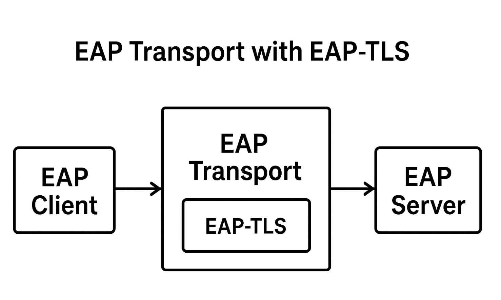

Great question! Let’s break it down step by step.

---

## 1. **Multiplexing and Demultiplexing in Networking**

* **Multiplexing (at the sender side):**

  * Multiple processes (apps) on a host want to send data over the network.
  * The OS/network stack *multiplexes* (combines) their data onto a single network interface (like a NIC).
  * To keep them separate, the OS tags data with identifiers (like **source port numbers**) so the receiver can tell which process sent what.

* **Demultiplexing (at the receiver side):**

  * The host receives a big stream of packets from the network interface.
  * The OS *demultiplexes* (separates) them to the right application by looking at:

    * Destination IP
    * Protocol (TCP/UDP)
    * Destination port number
  * Example: HTTP traffic (port 80) goes to the web server process, SSH traffic (port 22) goes to the SSH daemon.

---

## 2. **Where Sockets Fit In**

* A **socket** is the programming abstraction apps use to send/receive data.
* It represents an endpoint in communication, uniquely identified by a **4-tuple** (for TCP/UDP):

  ```
  (Source IP, Source Port, Destination IP, Destination Port)
  ```
* Multiplexing & demultiplexing are **how the OS binds packets to the right socket**:

  * When you call `socket()` in Python, Node.js, Go, etc., the OS assigns (or you bind) a port.
  * The transport layer (TCP/UDP) uses the port to map incoming packets to the right socket buffer.
  * Outgoing packets are tagged with your socket’s port → that’s multiplexing.

---

## 3. **Example Walkthrough**

* Suppose two apps run on the same machine:

  * **App A**: a web server on port `8080`
  * **App B**: an SSH server on port `22`

### Sending (Multiplexing):

* App A writes `Hello` to its socket (IP: `192.168.1.10`, Port: `8080`).
* App B writes `Ping` to its socket (IP: `192.168.1.10`, Port: `22`).
* The OS takes both messages, attaches **headers** (IP + TCP/UDP with correct port), and sends them over the single NIC.

### Receiving (Demultiplexing):

* A packet arrives with header:

  ```
  Dest IP: 192.168.1.10
  Dest Port: 8080
  ```

* OS checks socket table, finds the socket bound to port `8080`, and delivers it to App A.

* Another packet arrives with:

  ```
  Dest IP: 192.168.1.10
  Dest Port: 22
  ```

* Delivered to App B.

---

## 4. **Diagram (Conceptual)**

```
       Multiplexing (Sender)                       Demultiplexing (Receiver)
+-------------------------+                +-------------------------+
| App A (port 8080)       |                | App A (port 8080)       |
| App B (port 22)         |                | App B (port 22)         |
+-----------+-------------+                +-----------+-------------+
            |                                      ^
            v                                      |
    +--------------------+                 +--------------------+
    | Transport Layer    |                 | Transport Layer    |
    | (TCP/UDP)          |                 | (TCP/UDP)          |
    +--------------------+                 +--------------------+
            |                                      ^
            v                                      |
    +--------------------+                 +--------------------+
    | Network Interface  | <----Packets--->| Network Interface  |
    +--------------------+                 +--------------------+
```

---

✅ **Summary**:

* **Multiplexing** = combining multiple app data streams for sending, tagging them with ports.
* **Demultiplexing** = separating incoming packets by inspecting headers (IP + port) and delivering to the right socket.
* **Sockets** are the programming handle apps use; ports are how multiplexing/demultiplexing maps traffic to the right socket.

---

Do you want me to also compare this **socket multiplexing** with **Go goroutines or Node.js event loop multiplexing** (both also deal with concurrent I/O), so you see how OS-level vs runtime-level multiplexing works?

Here’s a diagram showing **network multiplexing and demultiplexing** and how it relates to **sockets**:

---

### 📌 Explanation

* **Multiplexing (Sender side):**

  * Multiple application processes each create a socket (identified by IP + Port).
  * The transport layer (e.g., TCP/UDP) adds **port numbers** to segment headers.
  * These segments are then combined into a single outgoing stream to the network layer (IP).

* **Demultiplexing (Receiver side):**

  * The transport layer receives incoming segments from the network.
  * It looks at the **destination port number** in each segment.
  * Using that port number, it directs the data to the correct application socket.

---

### 📊 Diagram

```
           Sender (Multiplexing)                       Receiver (Demultiplexing)
 ┌─────────────┐                                  ┌─────────────┐
 │  App 1      │                                  │  App 1      │
 │  Socket:1234│◄──────────┐              ┌──────►│  Socket:1234│
 └─────────────┘           │              │       └─────────────┘
 ┌─────────────┐           │              │       ┌─────────────┐
 │  App 2      │           │              │       │  App 2      │
 │  Socket:5678│◄──────────┼────┐   ┌─────┼──────►│  Socket:5678│
 └─────────────┘           │    │   │     │       └─────────────┘
 ┌─────────────┐           │    │   │     │       ┌─────────────┐
 │  App 3      │           │    │   │     │       │  App 3      │
 │  Socket:9012│◄──────────┘    │   │     └──────►│  Socket:9012│
 └─────────────┘                │   │             └─────────────┘
                                ▼   ▼
                          ┌────────────────┐
                          │ Transport Layer │
                          │ (TCP/UDP adds   │
                          │ port numbers)   │
                          └────────────────┘
                                │
                                ▼
                          ┌────────────────┐
                          │ Network Layer  │
                          │ (IP address)   │
                          └────────────────┘
```

---

✅ **Sockets = endpoints** that bind an application process to a transport port.
✅ **Multiplexing** = many sockets → one network connection stream.
✅ **Demultiplexing** = one incoming stream → delivered to the right socket via port number.

---

Do you want me to also show **how TCP and UDP differ in demultiplexing** (e.g., connection-oriented vs connectionless)?


Good question 👍 — here’s the breakdown:

---

### 1. **Where IP and Port live**

* **IP address** → belongs to the **Network layer** (IP layer).
* **Port number** → belongs to the **Transport layer** (TCP/UDP).
* Together, `(IP, Port)` = the **socket address** (endpoint of communication).

---

### 2. **Application layer protocols (like HTTP)**

* HTTP itself **does not define or carry IP/Port numbers** in its messages.

  * An HTTP request looks like:

    ```
    GET /index.html HTTP/1.1
    Host: www.example.com
    ```

    → No IP or Port here.
* Instead, HTTP **relies on TCP** (or sometimes UDP in newer cases like HTTP/3 with QUIC):

  * By convention, HTTP uses **TCP port 80** (and HTTPS uses **TCP port 443**).
  * The application tells the OS: “Open a TCP connection to host X on port 80.”
  * Then HTTP data is sent inside that TCP connection.

---

### 3. **Relationship**

* **TCP layer:** Adds source and destination **ports** (e.g., `srcPort=51514, dstPort=80`) and ensures reliable delivery.
* **IP layer:** Adds source and destination **IP addresses** (e.g., `192.168.1.10 → 142.250.72.46`).
* **Application layer (HTTP):** Just sends its text-based request/response **as payload inside TCP**.

---

✅ So:

* **HTTP has no IP/Port itself** — it’s just data.
* **TCP provides ports**, and **IP provides addresses** to actually deliver HTTP messages between machines.

---

Do you want me to draw a **layered diagram of an HTTP request going down the stack with IP + Port headers** so you can see exactly where each sits?


Perfect 👍 — let’s build a small Go program that demonstrates **multiplexing** (one server socket handling multiple clients) and **demultiplexing** (server distinguishing clients by their `(IP, port)` tuples).

We’ll write a **TCP Echo Server** and **multiple clients**.

* The **server** listens on one port (multiplexing).
* The **clients** each connect from different ephemeral ports.
* The server uses **Go goroutines** to handle them (demultiplexing by socket connection).

---

### 📌 Code: `multiplex_demo.go`

```go
package main

import (
	"bufio"
	"fmt"
	"net"
	"os"
	"strings"
	"time"
)

// =======================
// TCP SERVER
// =======================
func startServer() {
	listener, err := net.Listen("tcp", "127.0.0.1:9000")
	if err != nil {
		fmt.Println("Error starting server:", err)
		return
	}
	defer listener.Close()
	fmt.Println("Server listening on 127.0.0.1:9000")

	for {
		conn, err := listener.Accept()
		if err != nil {
			fmt.Println("Error accepting:", err)
			continue
		}
		// Each connection handled separately (demultiplexing)
		go handleConnection(conn)
	}
}

func handleConnection(conn net.Conn) {
	defer conn.Close()
	clientAddr := conn.RemoteAddr().String()
	fmt.Println("New client connected:", clientAddr)

	reader := bufio.NewReader(conn)
	for {
		message, err := reader.ReadString('\n')
		if err != nil {
			fmt.Println("Client disconnected:", clientAddr)
			return
		}
		message = strings.TrimSpace(message)
		fmt.Printf("Received from %s: %s\n", clientAddr, message)

		// Echo back
		conn.Write([]byte("Echo: " + message + "\n"))
	}
}

// =======================
// TCP CLIENT
// =======================
func startClient(id int) {
	conn, err := net.Dial("tcp", "127.0.0.1:9000")
	if err != nil {
		fmt.Println("Client", id, "error connecting:", err)
		return
	}
	defer conn.Close()

	fmt.Printf("Client %d connected from %s\n", id, conn.LocalAddr().String())

	for i := 0; i < 3; i++ {
		msg := fmt.Sprintf("Hello from client %d, msg %d", id, i+1)
		conn.Write([]byte(msg + "\n"))

		reply, _ := bufio.NewReader(conn).ReadString('\n')
		fmt.Printf("Client %d received: %s", id, reply)

		time.Sleep(time.Second)
	}
}

// =======================
// MAIN
// =======================
func main() {
	// Run server in a goroutine
	go startServer()

	// Wait for server startup
	time.Sleep(time.Second)

	// Start multiple clients
	for i := 1; i <= 3; i++ {
		go startClient(i)
	}

	// Keep program alive
	select {}
}
```

---

### 🔎 How this illustrates Multiplexing & Demultiplexing

* **Multiplexing**:
  Multiple clients connect to the same server **IP + Port (127.0.0.1:9000)**.
* **Demultiplexing**:
  The server differentiates them using the **(ClientIP, ClientPort)** pair (socket).
  Example:

  ```
  Client 1 -> 127.0.0.1:51234
  Client 2 -> 127.0.0.1:51235
  Client 3 -> 127.0.0.1:51236
  ```

  Server can tell messages apart based on these connections.

---

👉 Run it:

```bash
go run multiplex_demo.go
```

You’ll see multiple clients connecting, sending messages, and the server echoing them back while showing each client’s `(IP,port)`.

---

Do you also want me to extend this to show **UDP multiplexing/demultiplexing** (which is even more obvious because all clients share one socket on the server)?

Got it 👍 Let’s break this down in plain terms.

You’re talking about **EAP (Extensible Authentication Protocol)**, which is widely used in Wi-Fi authentication (like WPA/WPA2-Enterprise), VPNs, and other secure network access systems.

---

### 🔹 1. **EAP as a Generic Transport Service**

* EAP itself is **not an authentication protocol**.
* Instead, it’s like a **framework** or **envelope** that carries authentication messages between:

  * the **EAP client (supplicant)** → usually your laptop/phone, and
  * the **EAP authentication server** → typically a RADIUS server (e.g., FreeRADIUS, Microsoft NPS).

Think of EAP as the **“postal service”**: it delivers messages but doesn’t decide what the message says.

---

### 🔹 2. **How Authentication Happens with EAP**

* The client and server both need to **agree on a specific method** of authentication, called an **EAP method**.
* Examples of EAP methods:

  * **EAP-TLS** → uses certificates
  * **EAP-TTLS / PEAP** → uses TLS tunnel + username/password inside
  * **EAP-SIM / EAP-AKA** → used by mobile networks

Without an agreed method, the EAP transport alone can’t do authentication — it just passes data back and forth.

---

### 🔹 3. **Extending EAP with a Specific Authentication Protocol**

* When you install support for a certain EAP method (say EAP-TLS), both the client and server must **have the logic for that method** installed.
* This method runs **inside EAP**:

  * EAP handles the **transport** (carrying messages reliably).
  * The specific protocol (e.g., TLS) handles the **actual authentication** (certs, keys, credentials).

So:
👉 **EAP = wrapper/transport**
👉 **EAP method = real authentication logic inside**

---

### 🔹 4. Analogy

Think of EAP like a **delivery truck service**:

* The truck (EAP) just moves packages (auth messages).
* What’s inside the package (TLS, password, SIM auth) is the **actual authentication protocol**.
* Both sender and receiver must know how to “open and interpret” that package.

---

✅ **In short:**
EAP provides a **general way to carry authentication data**, but the **real authentication work** is done by a specific protocol (EAP-TLS, EAP-PEAP, etc.) that is installed and supported by both client and server.

---

Would you like me to **draw a flow diagram** (client ↔ EAP transport ↔ server with EAP-TLS inside) so it’s crystal clear?

