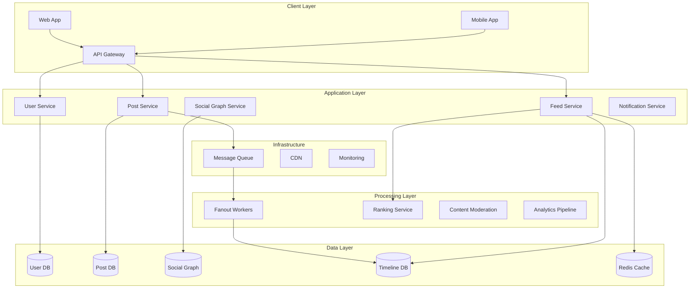

# News Feed System Design

## Overview

This document presents a comprehensive system design for a scalable news feed platform supporting 100 million users. The system employs a hybrid push-pull architecture with intelligent fanout strategies to handle both regular users and celebrities with massive followings. The design prioritizes performance, scalability, and reliability while maintaining sub-second response times for feed generation.

## ArchitectureL

### High-Level Architecture



### System Components

#### 1. API Gateway
- **Purpose**: Single entry point for all client requests
- **Responsibilities**: Authentication, rate limiting, request routing, SSL termination
- **Technology**: Kong/Envoy with custom plugins
- **Scaling**: Auto-scaling based on request volume (target: 50K RPS)

#### 2. User Service
- **Purpose**: Manages user accounts, profiles, and authentication
- **Responsibilities**: User CRUD operations, authentication, profile management
- **Database**: PostgreSQL with read replicas
- **Caching**: Redis for session data and frequently accessed profiles
- **Scaling**: Horizontal scaling with database sharding by user_id

#### 3. Post Service
- **Purpose**: Handles content creation, storage, and retrieval
- **Responsibilities**: Post creation, validation, storage, content moderation triggers
- **Database**: Cassandra for time-series post data
- **Storage**: S3 for media content (future extension)
- **Scaling**: Partitioned by author_id with consistent hashing

#### 4. Social Graph Service
- **Purpose**: Manages follow/unfollow relationships
- **Responsibilities**: Follow operations, follower/following lists, celebrity detection
- **Database**: Neo4j for complex graph queries, cached in Redis
- **Scaling**: Graph partitioning with hot data in memory

#### 5. Feed Service
- **Purpose**: Generates personalized feeds for users
- **Responsibilities**: Timeline assembly, ranking, pagination
- **Strategy**: Hybrid push-pull with intelligent routing
- **Caching**: Multi-layer caching (L1: Redis, L2: Application cache)

#### 6. Fanout Workers
- **Purpose**: Distributes posts to followers' timelines
- **Strategy**: Push for normal users (<100K followers), pull for celebrities
- **Processing**: Kafka-based event streaming with worker pools
- **Scaling**: Auto-scaling based on queue depth

## Components and Interfaces

### Core APIs

#### User Management API
```
POST /api/v1/users/register
POST /api/v1/users/login
GET /api/v1/users/{user_id}/profile
PUT /api/v1/users/{user_id}/profile
```

#### Social Graph API
```
POST /api/v1/users/{user_id}/follow
DELETE /api/v1/users/{user_id}/follow/{target_user_id}
GET /api/v1/users/{user_id}/followers?cursor={cursor}&limit={limit}
GET /api/v1/users/{user_id}/following?cursor={cursor}&limit={limit}
```

#### Content API
```
POST /api/v1/posts
GET /api/v1/posts/{post_id}
DELETE /api/v1/posts/{post_id}
GET /api/v1/users/{user_id}/posts?cursor={cursor}&limit={limit}
```

#### Feed API
```
GET /api/v1/users/{user_id}/feed?cursor={cursor}&limit=10
GET /api/v1/users/{user_id}/feed/refresh
```

### Internal Service Interfaces

#### Fanout Service Interface
```
ProcessPostCreated(post_id, author_id, timestamp)
ProcessFollowEvent(follower_id, followee_id, action)
GetCelebrityThreshold() -> int
```

#### Ranking Service Interface
```
RankPosts(user_id, post_ids[]) -> ranked_post_ids[]
GetUserAffinityScore(user_id, author_id) -> float
CalculateEngagementScore(post_id) -> float
```

## Data Models

### User Schema (PostgreSQL)
```sql
CREATE TABLE users (
    user_id BIGSERIAL PRIMARY KEY,
    username VARCHAR(50) UNIQUE NOT NULL,
    email VARCHAR(255) UNIQUE NOT NULL,
    password_hash VARCHAR(255) NOT NULL,
    display_name VARCHAR(100),
    bio TEXT,
    followers_count BIGINT DEFAULT 0,
    following_count BIGINT DEFAULT 0,
    is_verified BOOLEAN DEFAULT FALSE,
    is_celebrity BOOLEAN DEFAULT FALSE,
    created_at TIMESTAMPTZ DEFAULT NOW(),
    updated_at TIMESTAMPTZ DEFAULT NOW()
);

CREATE INDEX idx_users_username ON users(username);
CREATE INDEX idx_users_email ON users(email);
CREATE INDEX idx_users_celebrity ON users(is_celebrity) WHERE is_celebrity = TRUE;
```

### Post Schema (Cassandra)
```cql
CREATE TABLE posts (
    post_id UUID PRIMARY KEY,
    author_id BIGINT,
    content TEXT,
    created_at TIMESTAMP,
    updated_at TIMESTAMP,
    is_deleted BOOLEAN DEFAULT FALSE,
    engagement_score DOUBLE DEFAULT 0.0
);

CREATE TABLE posts_by_author (
    author_id BIGINT,
    created_at TIMESTAMP,
    post_id UUID,
    content TEXT,
    engagement_score DOUBLE,
    PRIMARY KEY (author_id, created_at, post_id)
) WITH CLUSTERING ORDER BY (created_at DESC, post_id ASC);
```

### Social Graph Schema (Neo4j + Redis)
```cypher
// Neo4j for complex queries
CREATE (u:User {user_id: $user_id, username: $username})
CREATE (u1:User)-[:FOLLOWS {since: $timestamp}]->(u2:User)

// Redis for hot data
ZADD followers:{user_id} {timestamp} {follower_id}
ZADD following:{user_id} {timestamp} {followee_id}
SET follower_count:{user_id} {count}
```

### Timeline Schema (Cassandra)
```cql
CREATE TABLE user_timeline (
    user_id BIGINT,
    created_at TIMESTAMP,
    post_id UUID,
    author_id BIGINT,
    PRIMARY KEY (user_id, created_at, post_id)
) WITH CLUSTERING ORDER BY (created_at DESC, post_id ASC);

CREATE TABLE celebrity_posts (
    author_id BIGINT,
    created_at TIMESTAMP,
    post_id UUID,
    content TEXT,
    PRIMARY KEY (author_id, created_at, post_id)
) WITH CLUSTERING ORDER BY (created_at DESC, post_id ASC);
```

## Error Handling

### Error Categories and Responses

#### Client Errors (4xx)
- **400 Bad Request**: Invalid input data, malformed requests
- **401 Unauthorized**: Authentication required or failed
- **403 Forbidden**: Insufficient permissions
- **404 Not Found**: Resource doesn't exist
- **429 Too Many Requests**: Rate limit exceeded

#### Server Errors (5xx)
- **500 Internal Server Error**: Unexpected server error
- **502 Bad Gateway**: Upstream service unavailable
- **503 Service Unavailable**: System overloaded or maintenance
- **504 Gateway Timeout**: Request timeout

### Error Handling Strategies

#### Circuit Breaker Pattern
```
- Open: Stop calling failing service
- Half-Open: Test service recovery
- Closed: Normal operation
- Thresholds: 50% error rate over 10 requests
```

#### Retry Logic
```
- Exponential backoff: 100ms, 200ms, 400ms, 800ms
- Max retries: 3 for idempotent operations
- Jitter: ±25% to prevent thundering herd
```

#### Graceful Degradation
- **Feed Service**: Fall back to cached data or pull-based generation
- **Social Graph**: Use cached follower counts
- **Content**: Show "Content temporarily unavailable" message

## Testing Strategy

### Unit Testing
- **Coverage Target**: 85% code coverage
- **Framework**: Go testing package with testify
- **Mocking**: Gomock for external dependencies
- **Database**: In-memory databases for fast tests

### Integration Testing
- **API Testing**: Postman/Newman for API contract testing
- **Database Testing**: Docker containers with test data
- **Message Queue**: Embedded Kafka for integration tests
- **End-to-End**: Cypress for critical user journeys

### Performance Testing
- **Load Testing**: K6 for API load testing
- **Stress Testing**: Gradual load increase to find breaking points
- **Spike Testing**: Sudden traffic spikes simulation
- **Volume Testing**: Large dataset performance validation

### Testing Environments
- **Development**: Local Docker compose setup
- **Staging**: Production-like environment with synthetic data
- **Performance**: Dedicated environment with production-scale data
- **Production**: Canary deployments with real traffic

### Test Data Management
- **Synthetic Data**: Faker libraries for realistic test data
- **Data Masking**: Anonymized production data for staging
- **Test Isolation**: Each test creates and cleans up its own data
- **Performance Data**: 1M users, 10M posts, 100M relationships

## Capacity Planning and Scaling

### Traffic Estimates
- **Daily Active Users**: 20M (20% of 100M total)
- **Posts Created**: 100M/day (1,157 posts/second average, 5K peak)
- **Feed Requests**: 200M/day (2,315 requests/second average, 10K peak)
- **Follow Operations**: 1M/day (11.6 operations/second)

### Storage Requirements
- **Posts**: 200GB/day (100M × 2KB), 73TB/year
- **User Data**: 10GB (100M × 100 bytes average)
- **Social Graph**: 40GB (1B relationships × 40 bytes)
- **Timelines**: 2TB (100M users × 20KB average timeline)
- **Total**: ~75TB/year with 3x replication = 225TB

### Infrastructure Scaling

#### Horizontal Scaling Triggers
- **CPU**: Scale out at 70% utilization
- **Memory**: Scale out at 80% utilization
- **Database**: Scale out at 80% connection pool usage
- **Queue**: Scale out at 1000 messages/second per worker

#### Database Sharding Strategy
- **User Data**: Shard by user_id hash (consistent hashing)
- **Posts**: Shard by author_id to co-locate user's posts
- **Timelines**: Shard by user_id for feed generation locality
- **Social Graph**: Partition by user_id with hot data replication

#### Caching Strategy
- **L1 Cache**: Application-level cache (5-minute TTL)
- **L2 Cache**: Redis cluster (1-hour TTL for feeds, 24-hour for profiles)
- **CDN**: Static content and API responses (varies by content type)
- **Cache Warming**: Proactive cache population for popular content

### Performance Optimization

#### Database Optimization
- **Read Replicas**: 3 read replicas per write master
- **Connection Pooling**: PgBouncer with 100 connections per pool
- **Query Optimization**: Proper indexing and query analysis
- **Partitioning**: Time-based partitioning for posts and timelines

#### Application Optimization
- **Connection Pooling**: HTTP client connection reuse
- **Batch Processing**: Bulk operations for fanout and database writes
- **Async Processing**: Non-blocking I/O for external service calls
- **Resource Pooling**: Object pools for frequently created objects


Great question! Let me clarify the relationship between the user profile database and social graph. They serve different purposes and have some overlap, but are optimized for different access patterns.

Read file(s)

design.md 120 - 181
Read file(s)

design.md 200 - 231
Perfect question! Let me explain the relationship and overlap between these two data stores:

User Profile Database vs Social Graph
User Profile Database (PostgreSQL)
Purpose: Stores core user identity and account information Data:

Basic profile info (username, email, bio, display_name)
Authentication data (password_hash)
Account metadata (created_at, is_verified)
Cached social metrics (followers_count, following_count, is_celebrity)
Social Graph Database (Neo4j + Redis)
Purpose: Stores and queries relationship data efficiently Data:

Follow relationships with timestamps
Complex graph queries (mutual follows, recommendations)
Hot relationship data for fast access
The Overlap and Relationship
Overlapping Data
-- User Profile DB (cached aggregates)
followers_count BIGINT DEFAULT 0,
following_count BIGINT DEFAULT 0,
is_celebrity BOOLEAN DEFAULT FALSE,

-- Social Graph (source of truth)
ZADD followers:{user_id} {timestamp} {follower_id}
SET follower_count:{user_id} {count}
Data Flow Pattern
1. User follows someone
   ↓
2. Social Graph stores the relationship (source of truth)
   ↓  
3. Update cached counts in User Profile DB
   ↓
4. Update celebrity status if threshold crossed
Why This Design?
Performance Optimization
Profile queries: Fast user lookup without graph traversal
Feed generation: Quick celebrity detection without graph queries
Authentication: No dependency on graph database for login
Scalability
User service: Can scale independently of social graph
Graph queries: Optimized database for relationship operations
Caching: Redis provides sub-millisecond relationship lookups
Practical Example
// Getting user profile (fast - single DB query)
user := userService.GetProfile(userID)
if user.IsCelebrity {
    // Use pull-based feed generation
}

// Getting followers (optimized for relationships)
followers := socialGraphService.GetFollowers(userID, limit)

// Complex graph query (when needed)
mutualFriends := socialGraphService.GetMutualFollows(userA, userB)
Data Consistency Strategy
Eventual Consistency
Social graph is source of truth for relationships
User profile has cached aggregates updated asynchronously
Acceptable delay: ~1 minute for count updates
Consistency Guarantees
Strong: Follow/unfollow operations in social graph
Eventual: Cached counts in user profile
Real-time: Hot data in Redis for active users
This design separates concerns while maintaining performance - user profiles for identity/auth, social graph for relationships, with strategic caching for the best of both worlds.


 Use S3 + References, Never Store Media in Cassandra
Here's the correct approach for handling media in your news feed system:

🚫 NEVER Do This:
-- ❌ WRONG: Storing media in timeline tables
CREATE TABLE user_timeline (
    user_id BIGINT,
    created_at TIMESTAMP,
    post_id UUID,
    content TEXT,
    image_data BLOB,    -- ❌ 5MB per image = disaster
    video_data BLOB     -- ❌ 100MB per video = catastrophe
);
Problems:

500TB+ storage for 100M posts with media
Slow timeline queries (loading unnecessary media)
No CDN optimization
4x higher costs vs object storage
✅ Correct Architecture:
graph LR
    A[Post Creation] --> B[Upload Media to S3]
    B --> C[Store S3 URLs in Cassandra]
    C --> D[Fanout URLs to Timelines]
    D --> E[Feed Shows CDN URLs]
📊 Data Model:
-- ✅ CORRECT: Store media references only
CREATE TABLE user_timeline (
    user_id BIGINT,
    created_at TIMESTAMP,
    post_id UUID,
    content TEXT,
    media_urls LIST<TEXT>,      -- S3/CDN URLs (small strings)
    media_types LIST<TEXT>,     -- image, video, gif
    PRIMARY KEY (user_id, created_at, post_id)
);
🔄 Workflow:
Upload: Media → S3 bucket → Get CDN URL
Store: Save CDN URLs in Cassandra (not media data)
Fanout: Copy URLs to follower timelines
Display: Frontend loads media from CDN URLs
💰 Cost Comparison:
| Storage | Cost/GB/month | 100TB Media | |---------|---------------|-------------| | S3 | 
0.023
∣
∗
∗
0.023∣∗∗2,300** | | Cassandra | 
0.10
+
∣
∗
∗
0.10+∣∗∗10,000+** |

S3 is 4x cheaper!

⚡ Performance Benefits:
Timeline queries: 5-10ms (vs 50-100ms with media)
Media loading: CDN-optimized globally
Storage efficiency: No replication overhead
Bandwidth: Separate from database traffic
🏗️ Implementation:
// Store references, not media
post := &Post{
    PostID:     uuid.New(),
    Content:    "Check out this photo!",
    MediaURLs:  []string{"https://cdn.example.com/image1.jpg"},
    MediaTypes: []string{"image/jpeg"},
}
Key principle: Cassandra for metadata, S3 for media. This separation gives you optimal performance, cost, and scalability for your 100M user system.