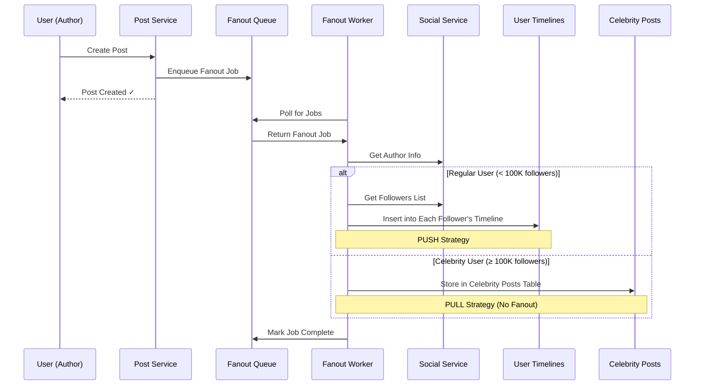

# Fanout Architecture Explained

## How Feed Service & Fanout Workers Function

### **NOT a Topic-Subscription Model**

The system does **NOT** work like Kafka topics where each user is a topic. Instead, it uses a **push-based timeline delivery** system with intelligent routing.

## Architecture Flow



## Detailed Workflow

### 1. **Post Creation Triggers Fanout**

```go
// When user creates a post
func (s *PostService) CreatePost(ctx context.Context, authorID int64, req *CreatePostRequest) (*Post, error) {
    // 1. Store the post
    post := createPost(req)
    
    // 2. Trigger fanout (async)
    s.enqueueFanout(ctx, post)  // ← This adds job to queue
    
    return post, nil
}
```

### 2. **Fanout Queue (Not Topics)**

The system uses a **centralized job queue**, not per-user topics:

```sql
-- Single fanout queue for ALL posts
CREATE TABLE fanout_queue (
    queue_id UUID PRIMARY KEY,
    post_id UUID,           -- Which post to distribute
    author_id BIGINT,       -- Who created the post
    status TEXT,            -- pending, processing, completed
    created_at TIMESTAMP
);
```

### 3. **Worker Processing Logic**

```go
func (w *FanoutWorker) processJob(ctx context.Context, job *FanoutQueueItem) error {
    // Get author info
    author := w.userService.GetUserByID(job.AuthorID)
    
    if author.IsCelebrity || author.FollowersCount >= 100000 {
        // CELEBRITY: Store in celebrity_posts table (no fanout)
        return w.processCelebrityPost(ctx, post)
    } else {
        // REGULAR USER: Push to all followers' timelines
        return w.processRegularUserPost(ctx, post)
    }
}
```

## Two Different Strategies

### **Strategy 1: Push-Based (Regular Users)**

For users with < 100K followers:

```go
func (w *FanoutWorker) processRegularUserPost(ctx context.Context, post *Post) error {
    // 1. Get ALL followers of the author
    followers := w.socialService.GetFollowers(post.AuthorID)
    
    // 2. Insert post into EACH follower's personal timeline
    for _, follower := range followers {
        insertIntoTimeline(follower.UserID, post)
    }
}
```

**Result**: Post is **physically copied** into each follower's timeline table:

```sql
-- user_timeline table
user_id | created_at | post_id | author_id | content
--------|------------|---------|-----------|--------
123     | 2024-01-01 | uuid1   | 456       | "Hello world"
789     | 2024-01-01 | uuid1   | 456       | "Hello world"  -- Same post, different user
```

### **Strategy 2: Pull-Based (Celebrities)**

For users with ≥ 100K followers:

```go
func (w *FanoutWorker) processCelebrityPost(ctx context.Context, post *Post) error {
    // Store in celebrity_posts table (NO fanout to followers)
    insertIntoCelebrityPosts(post)
    // No timeline inserts = no fanout explosion
}
```

**Result**: Post stored once in celebrity table, pulled on-demand during feed generation.

## Feed Generation Process

### **For Regular Users (Push-based)**

```go
func (s *FeedService) getPushBasedFeed(ctx context.Context, userID int64) []*FeedItem {
    // Read from user's pre-computed timeline
    return s.session.Query(`
        SELECT * FROM user_timeline 
        WHERE user_id = ? 
        ORDER BY created_at DESC 
        LIMIT 10
    `, userID)
}
```

### **For Celebrity Content (Pull-based)**

```go
func (s *FeedService) getPullBasedFeed(ctx context.Context, userID int64, celebrities []*UserConnection) []*FeedItem {
    var items []*FeedItem
    
    // For each celebrity the user follows
    for _, celebrity := range celebrities {
        // Get recent posts from celebrity_posts table
        posts := s.session.Query(`
            SELECT * FROM celebrity_posts 
            WHERE author_id = ? 
            ORDER BY created_at DESC 
            LIMIT 5
        `, celebrity.UserID)
        
        items = append(items, posts...)
    }
    
    return items
}
```

### **Hybrid Feed Assembly**

```go
func (s *FeedService) generateHybridFeed(ctx context.Context, userID int64) []*FeedItem {
    // 1. Get push-based content (pre-computed timeline)
    pushItems := s.getPushBasedFeed(userID)
    
    // 2. Get pull-based content (celebrity posts)
    celebrities := s.socialService.GetCelebritiesFollowed(userID)
    pullItems := s.getPullBasedFeed(userID, celebrities)
    
    // 3. Merge and rank
    allItems := append(pushItems, pullItems...)
    return s.rankFeedItems(userID, allItems)
}
```

## Key Differences from Topic Model

| Aspect | Topic Model (Kafka-style) | Our Fanout Model |
|--------|---------------------------|------------------|
| **Storage** | Each user = separate topic | Centralized job queue |
| **Delivery** | Subscribers pull from topics | Workers push to timelines |
| **Scalability** | Limited by topic count | Limited by worker capacity |
| **Celebrity Handling** | Still creates topic | Special pull-based handling |
| **Timeline Access** | Must subscribe to all followed users | Direct timeline query |

## Why This Approach?

### **Advantages**

1. **Fast Feed Reads**: User timeline is pre-computed, single query
2. **Celebrity Efficiency**: No fanout explosion for popular users
3. **Worker Scalability**: Can add more workers to handle load
4. **Flexible Ranking**: Can reorder timeline during read

### **Trade-offs**

1. **Storage Cost**: Duplicate posts across timelines
2. **Write Amplification**: One post → many timeline inserts
3. **Eventual Consistency**: Fanout takes time to complete

## Example Timeline Tables

### **Regular User Timeline (Push)**
```sql
-- Alice's timeline (user_id = 123)
user_id | created_at          | post_id | author_id | content
--------|--------------------|---------|-----------|---------
123     | 2024-01-01 10:00:00| uuid1   | 456       | "Bob's post"
123     | 2024-01-01 09:30:00| uuid2   | 789       | "Charlie's post"
123     | 2024-01-01 09:00:00| uuid3   | 101       | "Diana's post"
```

### **Celebrity Posts (Pull)**
```sql
-- Celebrity posts table
author_id | created_at          | post_id | content
----------|--------------------|---------|---------
999       | 2024-01-01 11:00:00| uuid4   | "Celebrity announcement!"
999       | 2024-01-01 10:30:00| uuid5   | "Behind the scenes..."
```

When Alice requests her feed:
1. **Push content**: Query her timeline table directly
2. **Pull content**: Check if she follows any celebrities, then query celebrity_posts
3. **Merge**: Combine both sources and rank by relevance

This gives us the **best of both worlds**: fast reads for regular content and efficient handling of celebrity posts!