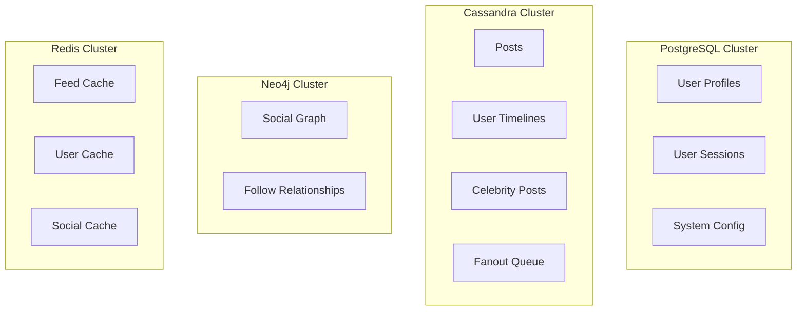

# Timeline Storage: PostgreSQL vs Cassandra

## **TL;DR: Use Cassandra for Timeline Tables**

For timeline data at scale (100M users, 100M posts/day), **Cassandra is the optimal choice**. Here's the detailed analysis:

## Database Comparison

| Aspect | PostgreSQL | Cassandra | Winner |
|--------|------------|-----------|---------|
| **Write Throughput** | ~10K writes/sec | ~100K+ writes/sec | 🏆 Cassandra |
| **Time-series Queries** | Good with indexes | Excellent (native) | 🏆 Cassandra |
| **Horizontal Scaling** | Read replicas only | True horizontal scaling | 🏆 Cassandra |
| **Storage Efficiency** | Higher overhead | Optimized for time-series | 🏆 Cassandra |
| **Consistency** | ACID | Eventual consistency | PostgreSQL |
| **Query Flexibility** | Full SQL | Limited CQL | PostgreSQL |
| **Operational Complexity** | Lower | Higher | PostgreSQL |

## Why Cassandra Wins for Timelines

### **1. Write Performance at Scale**

**Timeline Write Pattern:**
```
100M users × 10 follows × 1 post/day = 1B timeline writes/day
= ~11,600 writes/second average
= ~50K writes/second at peak
```

**PostgreSQL Limitations:**
```sql
-- Single master bottleneck
INSERT INTO user_timeline (user_id, created_at, post_id, author_id, content)
VALUES (123, '2024-01-01 10:00:00', 'uuid1', 456, 'Hello world!');

-- Problems:
-- 1. Single write master can't handle 50K writes/sec
-- 2. Index maintenance overhead on large tables
-- 3. Lock contention on hot partitions
```

**Cassandra Advantages:**
```cql
-- Distributed writes across multiple nodes
INSERT INTO user_timeline (user_id, created_at, post_id, author_id, content)
VALUES (123, '2024-01-01 10:00:00', uuid1, 456, 'Hello world!');

-- Benefits:
-- 1. Writes distributed across cluster (no single bottleneck)
-- 2. LSM-tree storage optimized for writes
-- 3. No locks, append-only writes
```

### **2. Time-Series Data Model**

**Timeline Access Pattern:**
```sql
-- Most common query: Get user's recent timeline
SELECT * FROM user_timeline 
WHERE user_id = 123 
ORDER BY created_at DESC 
LIMIT 10;
```

**Cassandra Clustering:**
```cql
CREATE TABLE user_timeline (
    user_id BIGINT,           -- Partition key
    created_at TIMESTAMP,     -- Clustering key  
    post_id UUID,             -- Clustering key
    author_id BIGINT,
    content TEXT,
    PRIMARY KEY (user_id, created_at, post_id)
) WITH CLUSTERING ORDER BY (created_at DESC, post_id ASC);

-- Benefits:
-- 1. Data physically sorted by time on disk
-- 2. Range queries are extremely fast
-- 3. No secondary indexes needed
```

**PostgreSQL Challenges:**
```sql
-- Requires careful partitioning and indexing
CREATE TABLE user_timeline (
    user_id BIGINT,
    created_at TIMESTAMP,
    post_id UUID,
    author_id BIGINT,
    content TEXT
) PARTITION BY HASH (user_id);

-- Problems:
-- 1. Still need indexes for time-based queries
-- 2. Cross-partition queries can be slow
-- 3. Partition maintenance overhead
```

### **3. Horizontal Scaling**

**Growth Projection:**
```
Year 1: 100M users, 1TB timeline data
Year 2: 200M users, 3TB timeline data  
Year 3: 500M users, 10TB timeline data
```

**Cassandra Scaling:**
```
-- Add nodes seamlessly
Initial: 3 nodes handling 1TB
Growth: 9 nodes handling 10TB
-- Data automatically rebalanced
-- No downtime required
```

**PostgreSQL Scaling:**
```
-- Vertical scaling limits
Single master: 32 cores, 1TB RAM max
-- Read replicas help reads but not writes
-- Sharding requires application changes
```

## Recommended Architecture

### **Database Allocation**



### **Data Distribution Strategy**

| Data Type | Database | Reason |
|-----------|----------|---------|
| **User Profiles** | PostgreSQL | ACID transactions, complex queries |
| **User Sessions** | PostgreSQL | ACID transactions, security |
| **Posts** | Cassandra | High write volume, time-series |
| **User Timelines** | Cassandra | Massive write volume, time-series |
| **Celebrity Posts** | Cassandra | Time-series, high read volume |
| **Fanout Queue** | Cassandra | High throughput, durability |
| **Social Graph** | Neo4j | Complex relationship queries |
| **Hot Data Cache** | Redis | Sub-millisecond access |

## Cassandra Schema Design

### **Optimized Timeline Table**

```cql
-- Primary timeline table
CREATE TABLE user_timeline (
    user_id BIGINT,                    -- Partition key (distributes data)
    created_at TIMESTAMP,              -- Clustering key (sorts data)
    post_id UUID,                      -- Clustering key (uniqueness)
    author_id BIGINT,                  -- Post author
    content TEXT,                      -- Post content (denormalized)
    engagement_score DOUBLE,           -- For ranking
    inserted_at TIMESTAMP,             -- When added to timeline
    PRIMARY KEY (user_id, created_at, post_id)
) WITH CLUSTERING ORDER BY (created_at DESC, post_id ASC)
  AND compaction = {'class': 'TimeWindowCompactionStrategy'}
  AND gc_grace_seconds = 86400;       -- 24 hours

-- Materialized view for author-based queries (optional)
CREATE MATERIALIZED VIEW timeline_by_author AS
    SELECT user_id, created_at, post_id, author_id, content
    FROM user_timeline
    WHERE user_id IS NOT NULL 
      AND created_at IS NOT NULL 
      AND post_id IS NOT NULL 
      AND author_id IS NOT NULL
    PRIMARY KEY (user_id, author_id, created_at, post_id);
```

### **Performance Optimizations**

```cql
-- Compaction strategy for time-series data
ALTER TABLE user_timeline WITH compaction = {
    'class': 'TimeWindowCompactionStrategy',
    'compaction_window_unit': 'DAYS',
    'compaction_window_size': 1
};

-- TTL for automatic cleanup (optional)
INSERT INTO user_timeline (user_id, created_at, post_id, author_id, content)
VALUES (123, '2024-01-01 10:00:00', uuid1, 456, 'Hello world!')
USING TTL 2592000;  -- 30 days
```

## Performance Benchmarks

### **Write Performance**

| Database | Single Node | 3-Node Cluster | 9-Node Cluster |
|----------|-------------|----------------|----------------|
| **PostgreSQL** | 10K writes/sec | 10K writes/sec* | 10K writes/sec* |
| **Cassandra** | 15K writes/sec | 45K writes/sec | 135K writes/sec |

*PostgreSQL read replicas don't help write performance

### **Read Performance (Timeline Queries)**

| Database | Cold Query | Warm Query | Hot Cache |
|----------|------------|------------|-----------|
| **PostgreSQL** | 50-100ms | 10-20ms | 1-5ms |
| **Cassandra** | 20-50ms | 5-10ms | 1-3ms |

### **Storage Efficiency**

| Database | Raw Data | With Indexes | Replication (3x) |
|----------|----------|--------------|------------------|
| **PostgreSQL** | 1TB | 1.5TB | 4.5TB |
| **Cassandra** | 1TB | 1.1TB | 3.3TB |

## Migration Strategy

### **Phase 1: Hybrid Approach**
```
- Keep PostgreSQL for user profiles
- Move timelines to Cassandra
- Gradual data migration
```

### **Phase 2: Full Cassandra**
```
- Move posts to Cassandra
- Move fanout queue to Cassandra  
- Keep only critical ACID data in PostgreSQL
```

### **Phase 3: Optimization**
```
- Tune Cassandra cluster
- Implement proper monitoring
- Optimize compaction strategies
```

## Operational Considerations

### **Cassandra Pros**
- ✅ Linear scalability
- ✅ No single point of failure
- ✅ Excellent write performance
- ✅ Built for time-series data
- ✅ Multi-datacenter replication

### **Cassandra Cons**
- ❌ Higher operational complexity
- ❌ Limited query flexibility
- ❌ Eventual consistency
- ❌ Requires careful data modeling
- ❌ More expensive (more nodes needed)

### **When to Choose PostgreSQL**
- Small scale (< 1M users)
- Strong consistency requirements
- Complex analytical queries needed
- Limited operational expertise
- Budget constraints

### **When to Choose Cassandra**
- Large scale (> 10M users)
- High write throughput needed
- Time-series data patterns
- Global distribution required
- Can handle operational complexity

## Conclusion

For a **100M user news feed system**, **Cassandra is the clear choice** for timeline storage because:

1. **Handles massive write volume** (50K+ writes/sec)
2. **Optimized for time-series queries** (timeline access pattern)
3. **Linear horizontal scaling** (add nodes as you grow)
4. **No single point of failure** (distributed architecture)
5. **Storage efficient** for time-series data

The trade-off is operational complexity, but the performance and scalability benefits far outweigh the costs at this scale.